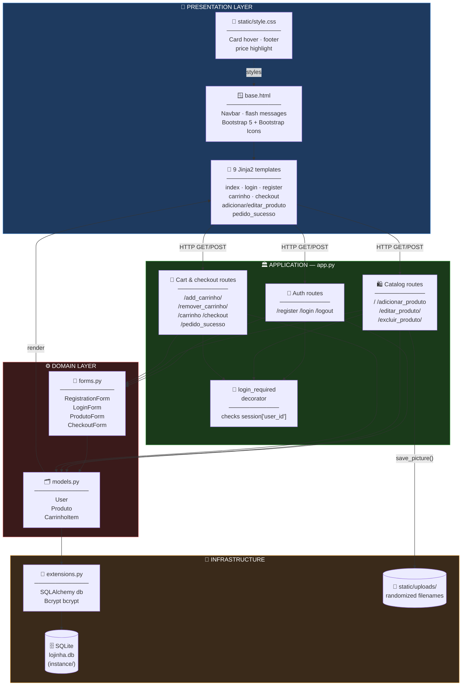
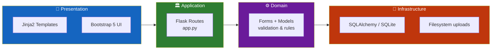
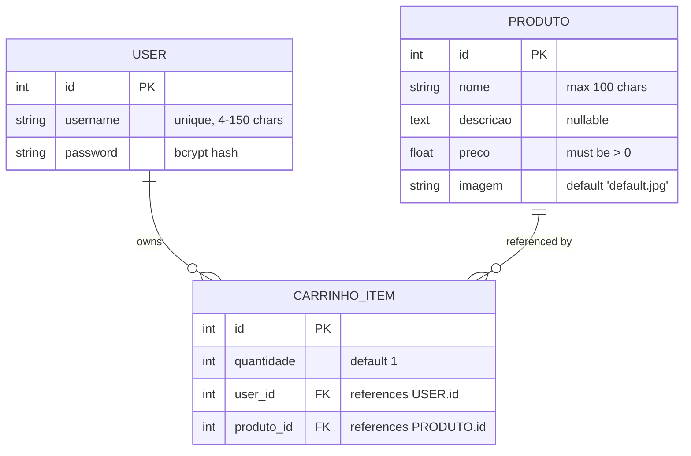
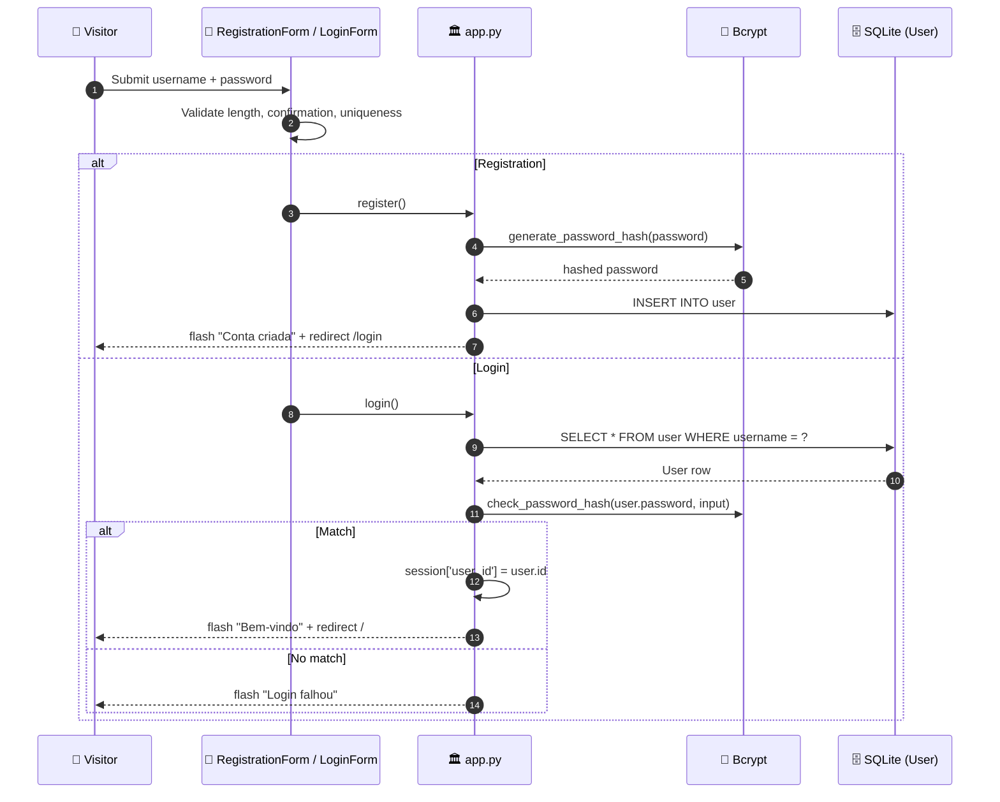
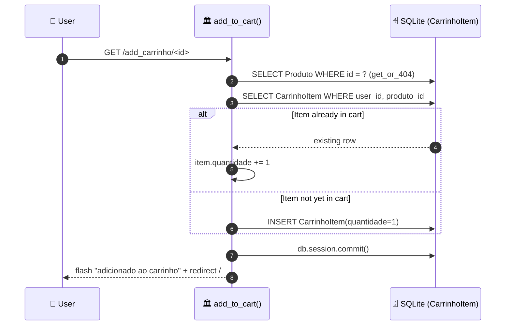
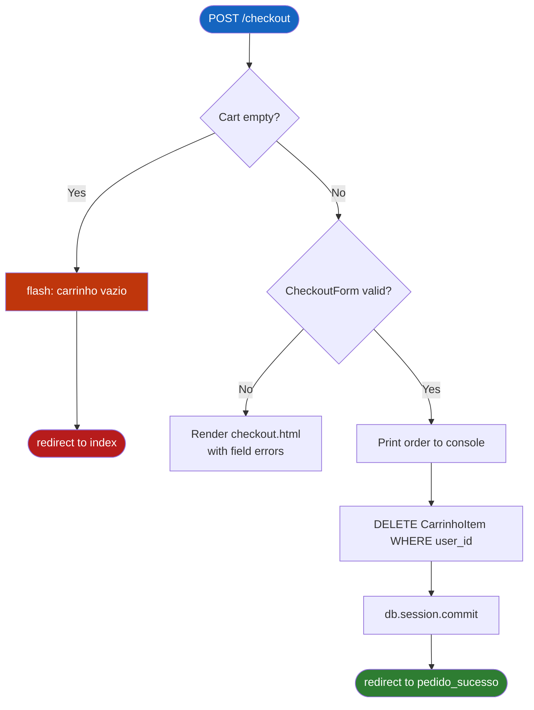
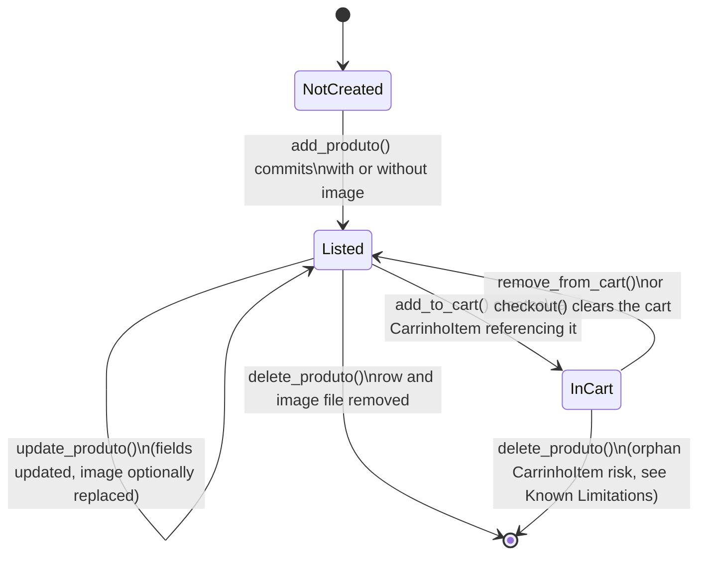
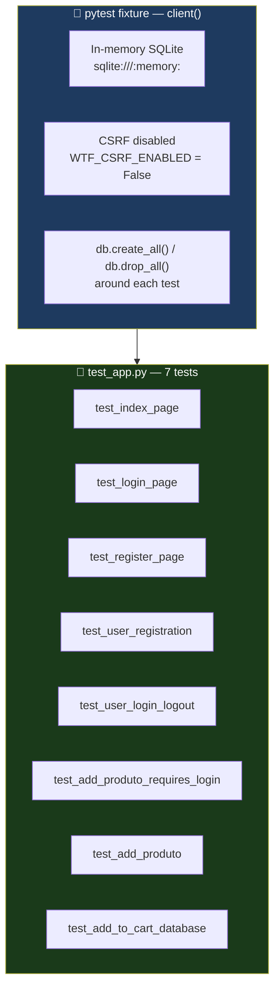

<div align="center">

**🌐 Choose Language / Selecione o Idioma / Elija el Idioma**

[](README.md)&nbsp;&nbsp;&nbsp;[](README_PT.md)&nbsp;&nbsp;&nbsp;[](README_ES.md)

</div>

---

<div align="center">

```
██╗      ██████╗      ██╗██╗███╗   ██╗██╗  ██╗ █████╗
██║     ██╔═══██╗     ██║██║████╗  ██║██║  ██║██╔══██╗
██║     ██║   ██║     ██║██║██╔██╗ ██║███████║███████║
██║     ██║   ██║██   ██║██║██║╚██╗██║██╔══██║██╔══██║
███████╗╚██████╔╝╚█████╔╝██║██║ ╚████║██║  ██║██║  ██║
╚══════╝ ╚═════╝  ╚════╝ ╚═╝╚═╝  ╚═══╝╚═╝  ╚═╝╚═╝  ╚═╝
        A small local-store web shop built with Flask
```

---

[](https://www.python.org/)
[](https://flask.palletsprojects.com/)
[](https://flask-sqlalchemy.palletsprojects.com/)
[](https://www.sqlite.org/)
[](https://flask-wtf.readthedocs.io/)
[](https://getbootstrap.com/)
[](https://pytest.org/)

<br/>

> **Lojinha Local is a small full-stack e-commerce demo:**
> catalog, cart and checkout for a local store, secured with hashed passwords and session-based login.

<br/>


</div>

---

## 📑 Table of Contents

<details>
<summary>▶️ <strong>Click to expand / collapse this section</strong></summary>

<table>
<tr>
<td valign="top" width="50%">

**🏗️ System**
- [Overview](#-overview)
- [System Architecture](#-system-architecture)
- [Technology Stack](#-technology-stack)
- [Design Patterns](#-design-patterns-applied)
- [Project Structure](#-project-structure)

**📦 Modules**
- [Application Bootstrap](#-application-bootstrap--appwsgipy)
- [Extensions](#-extensions--extensionspy)
- [Data Models](#-data-models--modelspy)
- [Forms](#-forms--formspy)
- [Authentication Routes](#-authentication-routes)
- [Catalog Routes](#-catalog-routes)
- [Cart & Checkout Routes](#-cart--checkout-routes)
- [Templates & Static Assets](#-templates--static-assets)

</td>
<td valign="top" width="50%">

**💼 Business**
- [Business Rules](#-business-rules)
- [Functional Requirements](#-functional-requirements)
- [Non-Functional Requirements](#-non-functional-requirements)

**📐 Design**
- [Data Model](#-data-model)
- [System Flows](#-system-flows)
- [Registration & Login Flow](#registration--login-flow)
- [Add to Cart Flow](#add-to-cart-flow)
- [Checkout Flow](#checkout-flow)
- [Product Lifecycle](#product-lifecycle-state-machine)

**🔐 Security & Ops**
- [Security](#-security)
- [Installation & Execution](#-installation--execution)
- [Automated Tests](#-automated-tests)
- [Metrics & Monitoring](#-metrics--monitoring)
- [Known Limitations](#-known-limitations)

</td>
</tr>
</table>

---

</details>

## 🌟 Overview

<details>
<summary>▶️ <strong>Click to expand / collapse this section</strong></summary>

**Lojinha Local** ("Local Little Shop") is a full-stack e-commerce demo written in **Python** with **Flask**. It implements the essential loop of an online shop: an authenticated owner manages a product catalog, visitors browse it, add items to a per-user cart persisted in the database, and complete an order through a checkout form.

The application is deliberately small and monolithic: a single `app.py` defines every route, `models.py` defines three SQLAlchemy models, `forms.py` defines four `Flask-WTF` forms, and nine Jinja2 templates extend a shared `base.html` styled with Bootstrap 5. There is no JavaScript framework, no REST API and no client-side state, every interaction is a full-page form submission or link navigation handled server-side.

Persistence uses **SQLite** through **Flask-SQLAlchemy**, passwords are hashed with **Flask-Bcrypt**, and CSRF protection on every form is provided by **Flask-WTF**. Product images are uploaded to `static/uploads/` with randomized filenames to avoid collisions and path traversal from user-supplied names.

### 🎯 System Objectives

| Objective | Description |
|-----------|-------------|
| 👤 **User Accounts** | Let visitors register and log in with a hashed password before managing the store |
| 🛍️ **Product Catalog** | Show every product on the home page with image, name, description and price |
| ➕ **Catalog Management** | Let authenticated users create, edit and delete products, including image uploads |
| 🛒 **Persistent Cart** | Keep a per-user shopping cart in the database, not in the session, so it survives across logins |
| 💳 **Checkout** | Collect the customer's name, e-mail and address, then clear the cart and confirm the order |
| 🖼️ **Image Handling** | Store uploaded images under randomized filenames and remove the old file when a product image is replaced or deleted |
| 🔐 **Access Control** | Gate every write-capable route (`add`, `edit`, `delete`, cart, checkout) behind a `login_required` decorator |
| 🧪 **Verifiability** | Ship an automated `pytest` suite covering registration, login/logout, product creation and cart persistence |

---

</details>

## 🏗️ System Architecture

<details>
<summary>▶️ <strong>Click to expand / collapse this section</strong></summary>

### Module Diagram



### Architecture Layers



---

</details>

## 🛠️ Technology Stack

<details>
<summary>▶️ <strong>Click to expand / collapse this section</strong></summary>

<table>
<thead>
<tr>
<th>Layer</th>
<th>Technology</th>
<th>Version</th>
<th>Purpose</th>
</tr>
</thead>
<tbody>
<tr>
<td rowspan="2"><strong>🧠 Language</strong></td>
<td>Python</td>
<td>3.x</td>
<td>Application source language</td>
</tr>
<tr>
<td>Jinja2</td>
<td>bundled with Flask</td>
<td>Server-side HTML templating</td>
</tr>
<tr>
<td rowspan="4"><strong>🌐 Web Framework</strong></td>
<td>Flask</td>
<td>unpinned (<code>requirements.txt</code>)</td>
<td>WSGI application, routing, request/response cycle</td>
</tr>
<tr>
<td>Flask-WTF</td>
<td>unpinned</td>
<td>Form objects, CSRF protection</td>
</tr>
<tr>
<td>WTForms</td>
<td>bundled with Flask-WTF</td>
<td>Field types and validators (<code>DataRequired</code>, <code>Email</code>, <code>EqualTo</code>...)</td>
</tr>
<tr>
<td>email_validator</td>
<td>unpinned</td>
<td>Backs the <code>Email()</code> validator used by <code>CheckoutForm</code></td>
</tr>
<tr>
<td rowspan="2"><strong>💾 Persistence</strong></td>
<td>Flask-SQLAlchemy</td>
<td>unpinned</td>
<td>ORM layer over <code>db.Model</code> (<code>User</code>, <code>Produto</code>, <code>CarrinhoItem</code>)</td>
</tr>
<tr>
<td>SQLite</td>
<td>engine bundled with Python</td>
<td>File-based relational database, <code>instance/lojinha.db</code></td>
</tr>
<tr>
<td rowspan="1"><strong>🔐 Security</strong></td>
<td>Flask-Bcrypt</td>
<td>unpinned</td>
<td>Password hashing (<code>generate_password_hash</code> / <code>check_password_hash</code>)</td>
</tr>
<tr>
<td rowspan="3"><strong>🎨 Frontend</strong></td>
<td>Bootstrap</td>
<td>5.3.2 (CDN)</td>
<td>Layout, cards, forms, navbar, alerts</td>
</tr>
<tr>
<td>Bootstrap Icons</td>
<td>1.11.1 (CDN)</td>
<td>Cart, person and trash icons in the navbar and cart table</td>
</tr>
<tr>
<td>Custom CSS</td>
<td><code>static/style.css</code></td>
<td>Card hover animation, sticky footer, price color</td>
</tr>
<tr>
<td rowspan="1"><strong>🧪 Testing</strong></td>
<td>pytest</td>
<td>unpinned</td>
<td>Functional tests over the Flask test client, <code>test_app.py</code></td>
</tr>
</tbody>
</table>

> [!NOTE]
> `requirements.txt` pins no version numbers (`Flask`, `Flask-SQLAlchemy`, `Flask-Bcrypt`, `Flask-WTF`, `pytest`, `email_validator`), so the exact resolved versions depend on whatever `pip` installs at setup time. Only the CDN-loaded frontend assets (Bootstrap, Bootstrap Icons) carry explicit versions, taken directly from `templates/base.html`.

---

</details>

## 🎨 Design Patterns Applied

<details>
<summary>▶️ <strong>Click to expand / collapse this section</strong></summary>

| Pattern | Where | Rationale |
|---------|-------|-----------|
| 🧭 **Application Factory (partial)** | `app = Flask(__name__)` + `db.init_app(app)` / `bcrypt.init_app(app)` in `app.py` | Extensions are instantiated in `extensions.py` and bound later, avoiding circular imports between `models.py` and `app.py` |
| 🚦 **Decorator / Guard Clause** | `login_required` in `app.py` | Centralizes the "must be authenticated" check instead of repeating it in every view |
| 🗂️ **Active Record (via ORM)** | `User`, `Produto`, `CarrinhoItem` in `models.py` | Each model wraps its own table and relationships, matching the way `Flask-SQLAlchemy` exposes `db.Model` |
| 📝 **Form Object** | `RegistrationForm`, `LoginForm`, `ProdutoForm`, `CheckoutForm` in `forms.py` | Validation rules and field definitions are declared once and reused across `GET`/`POST` handling |
| 🧩 **Template Inheritance** | `` in every page template | Navbar, flash messages and footer are defined once in `base.html` |
| 🔁 **Helper Extraction** | `save_picture()`, `get_cart_details()` in `app.py` | Repeated logic (file persistence, cart aggregation) is factored out of the route handlers |
| 🏷️ **Custom Validator** | `RegistrationForm.validate_username` | WTForms' convention of `validate_<field>` methods enforces username uniqueness against the database |
| 🔀 **Strategy (implicit)** | `ver_carrinho()` vs `get_cart_details()` | Two similar cart-aggregation strategies exist for display (dict of full item info) versus checkout (name + quantity only) |

---

</details>

## 📁 Project Structure

<details>
<summary>▶️ <strong>Click to expand / collapse this section</strong></summary>

```
lojinha_local/
│
├── 📄 app.py                       # Flask app factory, all 15 routes, save_picture(), login_required
├── 📄 extensions.py                # Shared SQLAlchemy `db` and Bcrypt `bcrypt` instances
├── 📄 models.py                    # User, Produto, CarrinhoItem SQLAlchemy models
├── 📄 forms.py                     # RegistrationForm, LoginForm, ProdutoForm, CheckoutForm
├── 📄 test_app.py                  # pytest suite (7 tests) over the Flask test client
├── 📄 requirements.txt             # Flask, Flask-SQLAlchemy, Flask-Bcrypt, Flask-WTF, pytest, email_validator
├── 📄 .gitignore                   # Excludes secrets, *.db, caches, venvs
├── 📄 produtos.db                  # Legacy/stray SQLite file at the repo root (unused by app.py)
│
├── 📂 instance/
│   └── 📄 lojinha.db               # Active SQLite database (SQLALCHEMY_DATABASE_URI)
│
├── 📂 images/                      # Seed/reference product photos (not served by Flask)
│   ├── download.jpg
│   ├── images.jpg
│   ├── vitaminico.jpg
│   └── whey_1kg.jpg
│
├── 📂 static/
│   ├── 📄 style.css                # Card hover, sticky footer, price color (served at /static/style.css)
│   └── 📂 uploads/                 # Uploaded product images, random 16-hex-char filenames
│       ├── 00c736fb18612e1c.jpg
│       ├── 3d1cc0a715767b0e.jpg
│       ├── a8d1f22085501241.jpg
│       ├── bb87983865f6ae47.jpg
│       └── d89f03ba49bf53f4.jpg
│
├── 📂 templates/
│   ├── 📄 base.html                # Shared layout: navbar, flash messages, footer
│   ├── 📄 index.html               # Product catalog grid
│   ├── 📄 login.html               # Login form
│   ├── 📄 register.html            # Registration form
│   ├── 📄 adicionar_produto.html   # Add-product form (multipart, image upload)
│   ├── 📄 editar_produto.html      # Edit-product form, pre-filled via `obj=produto`
│   ├── 📄 carrinho.html            # Cart table with subtotal/total and remove links
│   ├── 📄 checkout.html            # Order summary + CheckoutForm
│   └── 📄 pedido_sucesso.html      # Order confirmation page
│
├── 📄 README.md                    # 🇺🇸 English (primary)
├── 📄 README_PT.md                 # 🇧🇷 Português
└── 📄 README_ES.md                 # 🇪🇸 Español
```

---

</details>

## 📦 System Modules

<details>
<summary>▶️ <strong>Click to expand / collapse this section</strong></summary>

### 🏛️ Application Bootstrap — `app.py`

The entry point. Creates the `Flask` app, configures `SECRET_KEY`, `instance_path`, `SQLALCHEMY_DATABASE_URI`, `UPLOAD_FOLDER` and `MAX_CONTENT_LENGTH`, then binds the two shared extensions and registers all 15 routes.

| Responsibility | Implementation |
|-----------------|----------------|
| Config | `app.config['SQLALCHEMY_DATABASE_URI'] = 'sqlite:///lojinha.db'` (resolved inside `instance/`) |
| Upload directory | `app.config['UPLOAD_FOLDER'] = os.path.join(app.root_path, 'static', 'uploads')`, created with `os.makedirs(..., exist_ok=True)` |
| Upload size cap | `app.config['MAX_CONTENT_LENGTH'] = 16 * 1024 * 1024` (16 MB) |
| Extension binding | `db.init_app(app)`, `bcrypt.init_app(app)` |
| Dev entry point | `if __name__ == '__main__': db.create_all(); app.run(debug=True)` |

---

### 🔌 Extensions — `extensions.py`

A two-line module that exists purely to break the circular import between `app.py` (which needs `db` to configure the app) and `models.py` (which needs `db.Model` to declare tables).

| Object | Type | Purpose |
|--------|------|---------|
| `db` | `flask_sqlalchemy.SQLAlchemy()` | Shared ORM instance bound in `app.py`, imported by `models.py` |
| `bcrypt` | `flask_bcrypt.Bcrypt()` | Shared hashing instance bound in `app.py`, used in `register()` and `login()` |

---

### 🗂️ Data Models — `models.py`

Three `db.Model` classes with no custom `__init__` or `__repr__`, relying entirely on `Flask-SQLAlchemy` defaults.

| Model | Columns | Relationships |
|-------|---------|---------------|
| `User` | `id`, `username` (unique), `password` (bcrypt hash) | `carrinho_itens` — one-to-many to `CarrinhoItem`, `cascade="all, delete-orphan"` |
| `Produto` | `id`, `nome`, `descricao` (nullable), `preco` (`Float`), `imagem` (default `'default.jpg'`) | referenced by `CarrinhoItem.produto_id` |
| `CarrinhoItem` | `id`, `quantidade` (default `1`), `user_id` (FK), `produto_id` (FK) | `produto` — `db.relationship('Produto')`; `user` backref created from `User.carrinho_itens` |

---

### 📝 Forms — `forms.py`

Four `FlaskForm` subclasses, each paired one-to-one with a route.

| Form | Fields | Key validators |
|------|--------|-----------------|
| `RegistrationForm` | `username`, `password`, `confirm_password`, `submit` | `Length(min=4, max=150)` on username, `Length(min=6)` on password, `EqualTo('password')` on confirmation, custom `validate_username` uniqueness check |
| `LoginForm` | `username`, `password`, `submit` | `DataRequired()` on both fields |
| `ProdutoForm` | `nome`, `descricao`, `preco`, `imagem`, `submit_add`, `submit_update` | `Length(max=100)` on name, `NumberRange(min=0.01)` on price, `FileAllowed(['jpg','png','jpeg'])` on the image |
| `CheckoutForm` | `nomeCompleto`, `email`, `endereco`, `submit` | `Email()` on e-mail, `Length(min=10)` on address |

---

### 🔐 Authentication Routes

| Route | Methods | Handler | Behavior |
|-------|---------|---------|----------|
| `/register` | `GET`, `POST` | `register()` | Hashes the password with `bcrypt.generate_password_hash`, creates a `User`, redirects to `/login` |
| `/login` | `GET`, `POST` | `login()` | Looks up `User` by username, verifies with `bcrypt.check_password_hash`, stores `user_id`/`username` in `session` |
| `/logout` | `GET` | `logout()` | `login_required`; pops `user_id`/`username` from `session` |

---

### 🛍️ Catalog Routes

| Route | Methods | Handler | Behavior |
|-------|---------|---------|----------|
| `/` | `GET` | `index()` | Lists every `Produto` on the home page |
| `/adicionar_produto` | `GET`, `POST` | `add_produto()` | `login_required`; saves the uploaded image via `save_picture()`, creates a `Produto` |
| `/editar_produto/<int:id>` | `GET`, `POST` | `update_produto()` | `login_required`; `Produto.query.get_or_404(id)`, replaces the image file and deletes the old one if a new one is uploaded |
| `/excluir_produto/<int:id>` | `GET` | `delete_produto()` | `login_required`; deletes the image file from disk (unless it is `'default.jpg'`) and the `Produto` row |

---

### 🛒 Cart & Checkout Routes

| Route | Methods | Handler | Behavior |
|-------|---------|---------|----------|
| `/add_carrinho/<int:id>` | `GET` | `add_to_cart()` | `login_required`; increments `quantidade` if a `CarrinhoItem` already exists for this user/product, else creates one |
| `/remover_carrinho/<int:id>` | `GET` | `remove_from_cart()` | `login_required`; deletes the matching `CarrinhoItem` row |
| `/carrinho` | `GET` | `ver_carrinho()` | `login_required`; builds a display dict with name, price, quantity and subtotal per item, plus grand total |
| `/checkout` | `GET`, `POST` | `checkout()` | `login_required`; redirects to `/` if the cart is empty; on valid `CheckoutForm` submit, clears the user's `CarrinhoItem` rows and redirects to `/pedido_sucesso` |
| `/pedido_sucesso` | `GET` | `pedido_sucesso()` | `login_required`; renders the static confirmation page |

---

### 🖼️ Templates & Static Assets

| Asset | Role |
|-------|------|
| `templates/base.html` | Bootstrap navbar with conditional login/cart/logout links, flash-message rendering, footer |
| `templates/index.html` | Card grid iterating `produtos`, with add-to-cart / edit / delete actions per card |
| `templates/carrinho.html` | Table of `display_cart` items with a remove action and computed total |
| `templates/checkout.html` | Two-column layout: order summary from `display_order` plus the `CheckoutForm` |
| `static/style.css` | Card hover transform, green bold price, sticky footer |

---

</details>

## 💼 Business Rules

<details>
<summary>▶️ <strong>Click to expand / collapse this section</strong></summary>

### 👤 Account Rules

| # | Rule | Enforcement |
|---|------|-------------|
| BR-01 | Usernames must be unique | `RegistrationForm.validate_username` queries `User` before allowing submission |
| BR-02 | Usernames must be 4-150 characters | `Length(min=4, max=150)` on `RegistrationForm.username` |
| BR-03 | Passwords must be at least 6 characters | `Length(min=6)` on `RegistrationForm.password` |
| BR-04 | Password confirmation must match the password | `EqualTo('password')` on `confirm_password` |
| BR-05 | Passwords are never stored in plain text | `bcrypt.generate_password_hash` before `db.session.add(user)` |

### 🛍️ Catalog Rules

| # | Rule | Enforcement |
|---|------|-------------|
| BR-06 | A product's price must be strictly positive | `NumberRange(min=0.01)` on `ProdutoForm.preco` |
| BR-07 | Uploaded images must be JPG, PNG or JPEG | `FileAllowed(['jpg', 'png', 'jpeg'])` on `ProdutoForm.imagem` |
| BR-08 | Replacing a product image deletes the previous file, unless it is the default | `if produto.imagem and produto.imagem != 'default.jpg': os.remove(...)` in `update_produto()` |
| BR-09 | Deleting a product deletes its image file, unless it is the default | Same guard in `delete_produto()` |
| BR-10 | Uploaded filenames are randomized to avoid collisions | `save_picture()` uses `secrets.token_hex(8)` plus the original extension |

### 🛒 Cart & Checkout Rules

| # | Rule | Enforcement |
|---|------|-------------|
| BR-11 | Adding an already-carted product increments its quantity instead of duplicating the row | `add_to_cart()` checks `CarrinhoItem.query.filter_by(user_id=..., produto_id=...).first()` |
| BR-12 | The cart is scoped per authenticated user | Every cart query filters by `session['user_id']` |
| BR-13 | Checkout is blocked when the cart is empty | `if not display_order: flash(...); return redirect(url_for('index'))` |
| BR-14 | A successful checkout empties the cart | `CarrinhoItem.query.filter_by(user_id=user_id).delete()` inside `checkout()` |
| BR-15 | Deleting a `User` cascades to delete their cart items | `cascade="all, delete-orphan"` on `User.carrinho_itens` |

### 🔐 Access Rules

| # | Rule | Enforcement |
|---|------|-------------|
| BR-16 | Every write-capable or personal-data route requires an active session | `@login_required` on `add_produto`, `update_produto`, `delete_produto`, `add_to_cart`, `remove_from_cart`, `ver_carrinho`, `checkout`, `pedido_sucesso`, `logout` |
| BR-17 | An unauthenticated visitor is redirected to `/login` with a flash message | `login_required` decorator body |

---

</details>

## ✅ Functional Requirements

<details>
<summary>▶️ <strong>Click to expand / collapse this section</strong></summary>

| ID | Requirement | Priority | Status |
|----|-------------|----------|--------|
| **RF-01** | The system shall allow a visitor to register with a unique username and password | 🔴 High | ✅ Implemented |
| **RF-02** | The system shall reject registration if the username already exists | 🔴 High | ✅ Implemented |
| **RF-03** | The system shall allow a registered user to log in with username and password | 🔴 High | ✅ Implemented |
| **RF-04** | The system shall allow an authenticated user to log out | 🟡 Medium | ✅ Implemented |
| **RF-05** | The system shall list every product on the home page | 🔴 High | ✅ Implemented |
| **RF-06** | The system shall let an authenticated user add a new product with name, description, price and optional image | 🔴 High | ✅ Implemented |
| **RF-07** | The system shall let an authenticated user edit an existing product | 🔴 High | ✅ Implemented |
| **RF-08** | The system shall let an authenticated user delete a product | 🟡 Medium | ✅ Implemented |
| **RF-09** | The system shall delete the associated image file when a product is deleted or its image replaced | 🟡 Medium | ✅ Implemented |
| **RF-10** | The system shall let an authenticated user add a product to their cart | 🔴 High | ✅ Implemented |
| **RF-11** | The system shall increment the quantity when the same product is added again | 🟡 Medium | ✅ Implemented |
| **RF-12** | The system shall let a user remove an item from their cart | 🟡 Medium | ✅ Implemented |
| **RF-13** | The system shall display the cart with unit price, quantity, subtotal and grand total | 🔴 High | ✅ Implemented |
| **RF-14** | The system shall block checkout when the cart is empty | 🟡 Medium | ✅ Implemented |
| **RF-15** | The system shall collect full name, e-mail and address at checkout | 🔴 High | ✅ Implemented |
| **RF-16** | The system shall validate the e-mail format at checkout | 🟡 Medium | ✅ Implemented |
| **RF-17** | The system shall empty the cart after a successful checkout | 🔴 High | ✅ Implemented |
| **RF-18** | The system shall show an order-confirmation page after checkout | 🟢 Low | ✅ Implemented |
| **RF-19** | The system shall show flash feedback for every create/update/delete/login/logout action | 🟢 Low | ✅ Implemented |
| **RF-20** | The system shall protect every state-changing route behind authentication | 🔴 High | ✅ Implemented |
| **RF-21** | The system shall persist the checkout submission (name, e-mail) beyond a console log | 🟡 Medium | ⬜ Planned |
| **RF-22** | The system shall let a user change the quantity of a cart item directly | 🟢 Low | ⬜ Planned |

---

</details>

## ⚡ Non-Functional Requirements

<details>
<summary>▶️ <strong>Click to expand / collapse this section</strong></summary>

| ID | Category | Requirement | Target |
|----|----------|-------------|--------|
| **RNF-01** | 🔐 Security | Passwords must never be stored or logged in plain text | 100% of stored passwords are bcrypt hashes |
| **RNF-02** | 🔐 Security | Every form submission must carry a CSRF token | Enforced via `Flask-WTF` `hidden_tag()` on all 4 forms |
| **RNF-03** | 📦 Upload Safety | Uploaded files must be capped in size | `MAX_CONTENT_LENGTH = 16 * 1024 * 1024` (16 MB) |
| **RNF-04** | 📦 Upload Safety | Uploaded product images must be restricted to safe image types | `FileAllowed(['jpg', 'png', 'jpeg'])` |
| **RNF-05** | 🗂️ Data Integrity | Every cart row must reference a valid user and product | `ForeignKey('user.id')`, `ForeignKey('produto.id')` with `nullable=False` |
| **RNF-06** | ⚡ Performance | Cart aggregation must avoid N+1 queries | `options(db.joinedload(CarrinhoItem.produto))` in `ver_carrinho()` and `get_cart_details()` |
| **RNF-07** | 🎨 Usability | The UI must render correctly on mobile and desktop | Bootstrap 5 responsive grid classes (`col-md-4`, `row g-5`, etc.) |
| **RNF-08** | 🎨 Usability | Every destructive action must ask for confirmation | `onclick="return confirm(...)"` on the delete-product link |
| **RNF-09** | 🌍 Internationalization | UI copy and flash messages are in a single language | All strings currently hardcoded in Brazilian Portuguese |
| **RNF-10** | 🧱 Maintainability | Shared UI chrome must live in one place | `base.html` template inheritance across all 8 page templates |
| **RNF-11** | 🧱 Maintainability | ORM instances must be defined once to avoid circular imports | Centralized in `extensions.py` |
| **RNF-12** | 🧪 Testability | Core flows must be covered by an automated test suite | `test_app.py`, 7 tests over the Flask test client |
| **RNF-13** | 🔧 Configurability | Database location and upload folder must be resolvable relative to the app | `app.instance_path`, `app.root_path` used instead of hardcoded absolute paths |
| **RNF-14** | 💾 Portability | The database engine must not require an external server | SQLite file at `instance/lojinha.db` |
| **RNF-15** | ♿ Accessibility | Form fields must carry associated `<label>` elements | `form.<field>.label(...)` rendered before every input in all form templates |

---

</details>

## 🗄️ Data Model

<details>
<summary>▶️ <strong>Click to expand / collapse this section</strong></summary>

### Entity-Relationship Diagram



### Schema Detail

| Table | Column | Type | Constraints |
|-------|--------|------|-------------|
| `user` | `id` | `Integer` | Primary key |
| `user` | `username` | `String(150)` | Unique, not null |
| `user` | `password` | `String(150)` | Not null, bcrypt hash |
| `produto` | `id` | `Integer` | Primary key |
| `produto` | `nome` | `String(100)` | Not null |
| `produto` | `descricao` | `Text` | Nullable |
| `produto` | `preco` | `Float` | Not null |
| `produto` | `imagem` | `String(300)` | Nullable, default `'default.jpg'` |
| `carrinho_item` | `id` | `Integer` | Primary key |
| `carrinho_item` | `quantidade` | `Integer` | Not null, default `1` |
| `carrinho_item` | `user_id` | `Integer` | Foreign key → `user.id`, not null |
| `carrinho_item` | `produto_id` | `Integer` | Foreign key → `produto.id`, not null |

### Storage Locations

| Concern | Location | Notes |
|---------|----------|-------|
| Relational data | `instance/lojinha.db` | Created by `db.create_all()` on first run inside the Flask app context |
| Uploaded images | `static/uploads/<16-hex>.<ext>` | Filename generated by `secrets.token_hex(8)` in `save_picture()` |
| Stray database file | `produtos.db` (repo root) | Present in the repository but not referenced by `SQLALCHEMY_DATABASE_URI`, appears to be a leftover from an earlier setup |

---

</details>

## 🔄 System Flows

<details>
<summary>▶️ <strong>Click to expand / collapse this section</strong></summary>

### Registration & Login Flow



### Add to Cart Flow



### Checkout Flow



### Product Lifecycle (State Machine)



---

</details>

## 🔐 Security

<details>
<summary>▶️ <strong>Click to expand / collapse this section</strong></summary>

### Implemented Controls

| Control | Implementation | Effect |
|---------|---------------|--------|
| 🔐 **Password hashing** | `flask_bcrypt.Bcrypt` in `extensions.py`, used by `register()`/`login()` | Plain-text passwords are never persisted |
| 🛡️ **CSRF protection** | `Flask-WTF` `hidden_tag()` rendered in every form template | Cross-site request forgery is rejected unless a valid token is present |
| 🚦 **Route-level authorization** | `login_required` decorator on 9 routes | Unauthenticated requests to protected routes are redirected, not executed |
| 🧾 **Server-side validation** | WTForms validators (`DataRequired`, `Length`, `Email`, `EqualTo`, `NumberRange`, `FileAllowed`) | Malformed input is rejected before it reaches the database |
| 📦 **Upload size cap** | `MAX_CONTENT_LENGTH = 16 * 1024 * 1024` | Oversized uploads are rejected by Flask before reaching the view |
| 🖼️ **Filename randomization** | `save_picture()` uses `secrets.token_hex(8)` | User-supplied filenames never reach the filesystem directly, mitigating path traversal |
| 🗂️ **Scoped queries** | Every cart query filters by `session['user_id']` | A user cannot read or modify another user's cart items through the exposed routes |

### Known Security Limitations

> [!WARNING]
> The following are inherent to the current design and should be understood before any production use.

| Limitation | Risk | Mitigation path |
|------------|------|-----------------|
| 🔑 **Hardcoded `SECRET_KEY`** | `app.config['SECRET_KEY'] = 'sua_chave_secreta_muito_segura'` is committed in `app.py` | Load the key from an environment variable, never commit it |
| 🐛 **`debug=True` in the entry point** | `app.run(debug=True)` exposes the Werkzeug interactive debugger if reachable from outside localhost | Disable debug mode outside local development, use an environment flag |
| 🧍 **No authorization ownership check on products** | Any authenticated user can edit or delete any product, not just their own | Add an `owner_id` on `Produto` and check it in `update_produto`/`delete_produto` |
| 🗂️ **No rate limiting on login/register** | Brute-force credential guessing is not throttled | Add `Flask-Limiter` or a reverse-proxy rate limit |
| 📝 **Order data is only printed to the console** | `checkout()` uses `print(...)`, so submitted name/e-mail are not durably stored or auditable | Persist orders to a dedicated `Pedido` model |
| 🖼️ **Uploaded file extension trusted from the client MIME hint** | `FileAllowed` checks the extension, not the file's actual content bytes | Validate magic bytes / re-encode the image server-side |
| 🍪 **Session cookie uses Flask defaults** | No explicit `SESSION_COOKIE_SECURE` / `SESSION_COOKIE_HTTPONLY` configuration in `app.py` | Set those flags explicitly, especially before deploying over HTTPS |

---

</details>

## 🚀 Installation & Execution

<details>
<summary>▶️ <strong>Click to expand / collapse this section</strong></summary>

### Prerequisites

```bash
# Python 3.x with pip
python --version
pip --version
```

### Build

```bash
# Clone or enter the project directory
cd lojinha_local

# (Recommended) create and activate a virtual environment
python -m venv venv
# Windows:
venv\Scripts\activate
# macOS/Linux:
source venv/bin/activate

# Install dependencies
pip install -r requirements.txt
```

### Execution

```bash
# Run the development server (creates instance/lojinha.db on first run)
python app.py
# Flask starts in debug mode on http://127.0.0.1:5000/
```

**In-app usage**

1. Open `http://127.0.0.1:5000/` — the catalog loads empty on first run.
2. Click **Cadastro** and create an account (username 4+ chars, password 6+ chars).
3. Log in, then click **Adicionar Produto** to create the first product (name, price, optional image).
4. From the home page, use **Adicionar ao Carrinho** on any product card.
5. Open **Carrinho** to review quantities and the total, then **Finalizar Compra**.
6. Fill in name, e-mail and address, submit, and land on the order-confirmation page.

### Scripts & Targets

| Command | Purpose |
|---------|---------|
| `python app.py` | Run the development server with `db.create_all()` executed on startup |
| `pip install -r requirements.txt` | Install Flask, Flask-SQLAlchemy, Flask-Bcrypt, Flask-WTF, pytest, email_validator |
| `pytest` | Run the automated test suite (`test_app.py`) |
| `pytest -v` | Run tests with verbose per-test output |

### Configuration Reference

| Setting | Value | Declared in |
|---------|-------|-------------|
| `SECRET_KEY` | hardcoded string | `app.py` |
| `SQLALCHEMY_DATABASE_URI` | `sqlite:///lojinha.db` | `app.py` (resolved against `instance_path`) |
| `UPLOAD_FOLDER` | `static/uploads/` | `app.py` |
| `MAX_CONTENT_LENGTH` | `16 * 1024 * 1024` (16 MB) | `app.py` |
| `debug` | `True` | `app.run(debug=True)` in `app.py` |

---

</details>

## 🧪 Automated Tests

<details>
<summary>▶️ <strong>Click to expand / collapse this section</strong></summary>

### Test Architecture



| Test | Verifies |
|------|----------|
| `test_index_page` | `/` returns 200 and renders "Nossos Produtos" |
| `test_login_page` | `/login` returns 200 and renders "Login" |
| `test_register_page` | `/register` returns 200 and renders "Cadastro" |
| `test_user_registration` | Registration succeeds and the `User` row exists afterward |
| `test_user_login_logout` | Login sets `session['user_id']`, logout clears it |
| `test_add_produto_requires_login` | Unauthenticated `GET /adicionar_produto` redirects to the login flash |
| `test_add_produto` | Authenticated product creation persists a `Produto` with the correct price |
| `test_add_to_cart_database` | `add_to_cart` persists a `CarrinhoItem` with `quantidade == 1` |

### Running the Tests

```bash
# Run the full suite
pytest

# Run with verbose output
pytest -v

# Run a single test
pytest test_app.py::test_user_login_logout
```

### Manual Acceptance Checklist

| # | Scenario | Expected result |
|---|----------|------------------|
| 1 | Register with a username shorter than 4 characters | Form re-renders with a length validation error |
| 2 | Register with a duplicate username | Form re-renders with "Esse nome de usuário já existe" |
| 3 | Log in with wrong password | Flash "Login falhou" is shown |
| 4 | Add a product without an image | Product is listed using `default.jpg` |
| 5 | Edit a product and upload a new image | Old image file is removed from `static/uploads/` |
| 6 | Add the same product to the cart twice | Quantity becomes 2, no duplicate row |
| 7 | Visit `/checkout` with an empty cart | Redirected to `/` with a warning flash |
| 8 | Complete checkout | Cart is emptied and the confirmation page is shown |
| 9 | Visit any protected route while logged out | Redirected to `/login` with a warning flash |

---

</details>

## 📊 Metrics & Monitoring

<details>
<summary>▶️ <strong>Click to expand / collapse this section</strong></summary>

### Codebase Metrics

| Metric | Value |
|--------|-------|
| Python source files | 4 (`app.py`, `extensions.py`, `models.py`, `forms.py`) + `test_app.py` |
| Flask routes | 15 |
| SQLAlchemy models | 3 (`User`, `Produto`, `CarrinhoItem`) |
| WTForms form classes | 4 |
| Jinja2 templates | 9 |
| pytest tests | 8 (7 named `test_*` functions plus 1 helper) |
| Sample uploaded images present | 5 files in `static/uploads/` |
| Reference images (unused by the app) | 4 files in `images/` |

### Runtime Signals

| Signal | Source | Where to observe |
|--------|--------|-------------------|
| Flash messages | `flash(message, category)` calls throughout `app.py` | Rendered inside `base.html`'s `get_flashed_messages` block |
| Session state | `session['user_id']`, `session['username']` | Server-side session cookie |
| SQL activity | SQLAlchemy ORM calls | Enable `app.config['SQLALCHEMY_ECHO'] = True` to log SQL to stdout |
| Request/response cycle | Flask's built-in development server log | Console output when running `python app.py` |

### Useful Commands

```bash
# Inspect the SQLite schema directly
sqlite3 instance/lojinha.db ".schema"

# Count rows per table
sqlite3 instance/lojinha.db "SELECT COUNT(*) FROM user;"
sqlite3 instance/lojinha.db "SELECT COUNT(*) FROM produto;"
sqlite3 instance/lojinha.db "SELECT COUNT(*) FROM carrinho_item;"

# List uploaded product images
ls static/uploads/

# Run the test suite with a coverage-style verbose report
pytest -v
```

### Standardized Status Codes

| Code | Meaning | Where it appears |
|------|---------|-------------------|
| `200` | Successful page render | Every `GET` route on success |
| `302` | Redirect | After every successful `POST` (`register`, `login`, `add_produto`, `checkout`, ...) |
| `404` | Not found | `get_or_404()` in `update_produto` and `delete_produto` |
| `413` | Payload too large | Upload exceeding `MAX_CONTENT_LENGTH` (16 MB) |

---

</details>

## ⚠️ Known Limitations

<details>
<summary>▶️ <strong>Click to expand / collapse this section</strong></summary>

> [!IMPORTANT]
> This project is a learning/demo application. Several shortcuts documented here are appropriate for a local demo but would need to be addressed before any real deployment.

| Category | Issue | Status |
|----------|-------|--------|
| 🎨 **Broken stylesheet link** | `base.html` requests `static/css/style.css`, but the file is actually at `static/style.css` | ⚠️ Open |
| 🔑 **Hardcoded secret key** | `SECRET_KEY` is a literal string committed to `app.py` | ⚠️ Open |
| 🐛 **Debug mode on the run entry point** | `app.run(debug=True)` is unconditional | ⚠️ Open |
| 📝 **Checkout data not persisted** | `checkout()` only `print()`s the submitted name/e-mail, no `Pedido`/order table exists | ⚠️ Open |
| 🧍 **No product ownership check** | Any logged-in user can edit or delete any product | ⚠️ Open |
| 🗑️ **Orphan cart rows possible** | Deleting a `Produto` does not clean up `CarrinhoItem` rows that reference it | ⚠️ Open |
| 🗄️ **Stray `produtos.db` file** | An unused SQLite file sits at the repository root, unrelated to the configured `instance/lojinha.db` | ⚠️ Open |
| 🌍 **Single hardcoded language** | All UI text and flash messages are hardcoded Portuguese, no i18n layer | ➕ Intentional |
| 🧪 **No coverage for edit/delete routes** | `test_app.py` covers registration, login, adding a product and adding to cart, but not `update_produto`, `delete_produto`, `remove_from_cart` or `checkout` | ⚠️ Open |
| 🔢 **No quantity editing in the cart UI** | `carrinho.html` can only remove an item, not change its quantity directly | ➕ Intentional |
| 🔒 **No production WSGI server configured** | Only the Flask development server (`app.run`) is present, no gunicorn/waitress setup | ⚠️ Open |

> [!TIP]
> The single highest-value fix is persisting checkout submissions into a real `Pedido` model, it would immediately unlock order history, receipts, and a foundation for the currently-missing quantity-editing and product-ownership features.

</details>

---

<div align="center">

---

### 🛒 Lojinha Local

*Small store, straightforward Flask.*

[](https://www.python.org/)
[](https://flask.palletsprojects.com/)
[](https://www.sqlite.org/)
[](https://pytest.org/)

<br/>

```
"A shop is just a catalog, a cart, and someone willing to check out.
 Everything else is polish."
```

</div>
