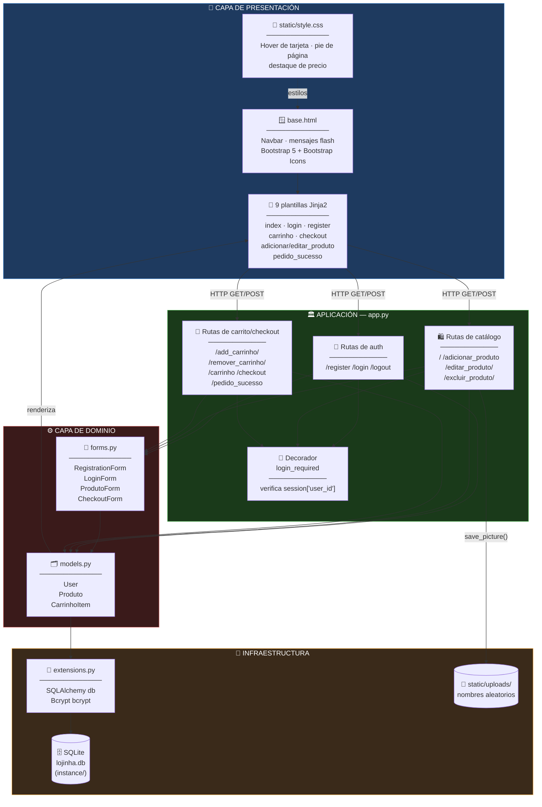
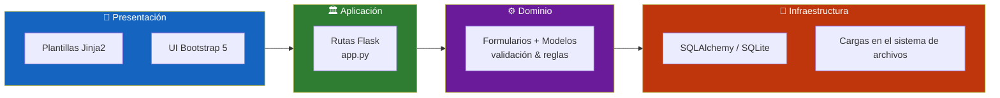
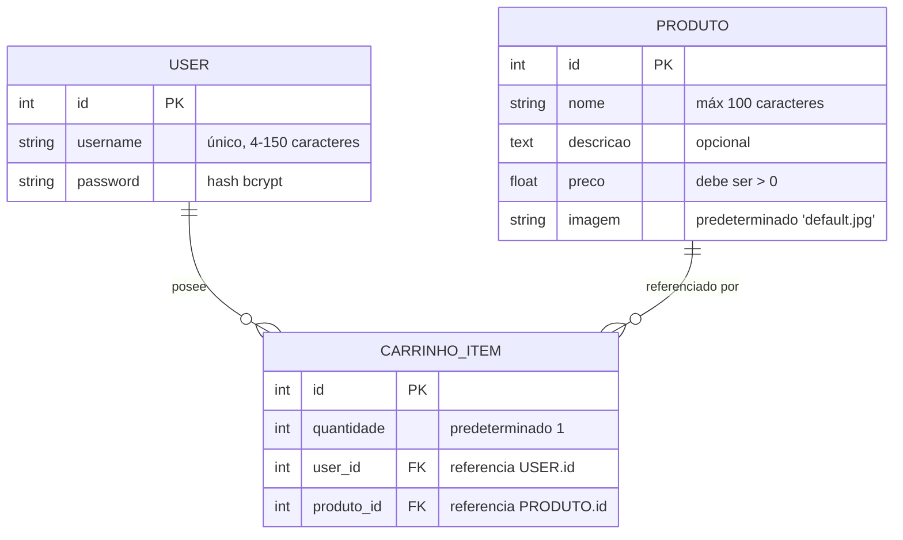
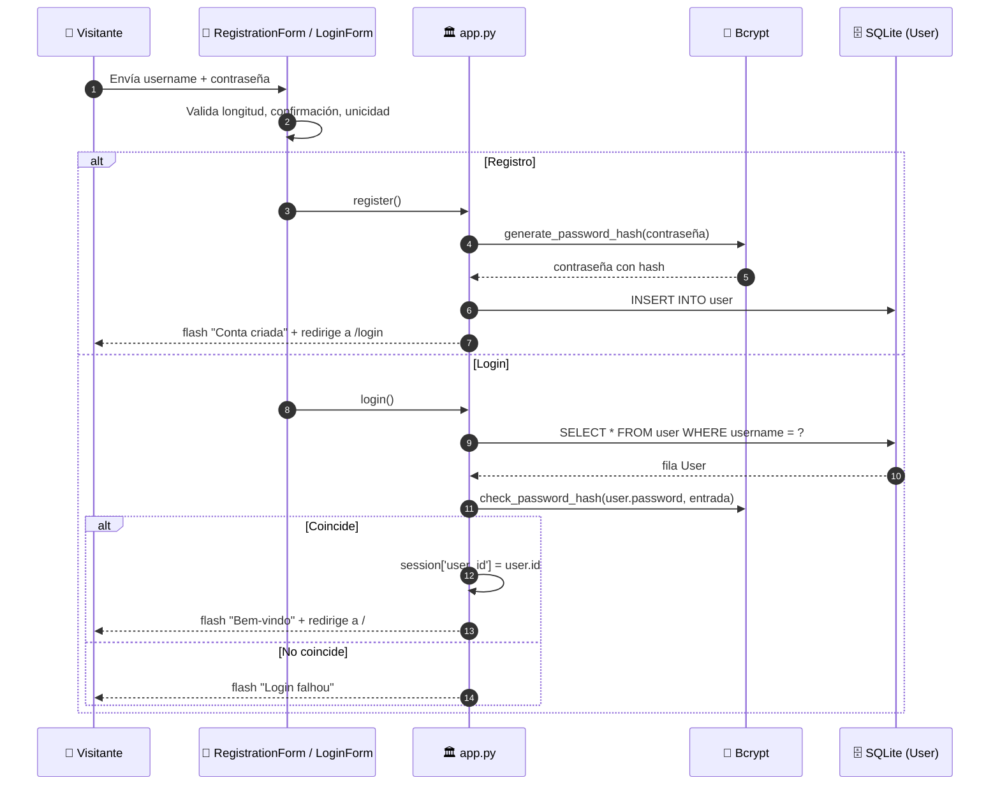
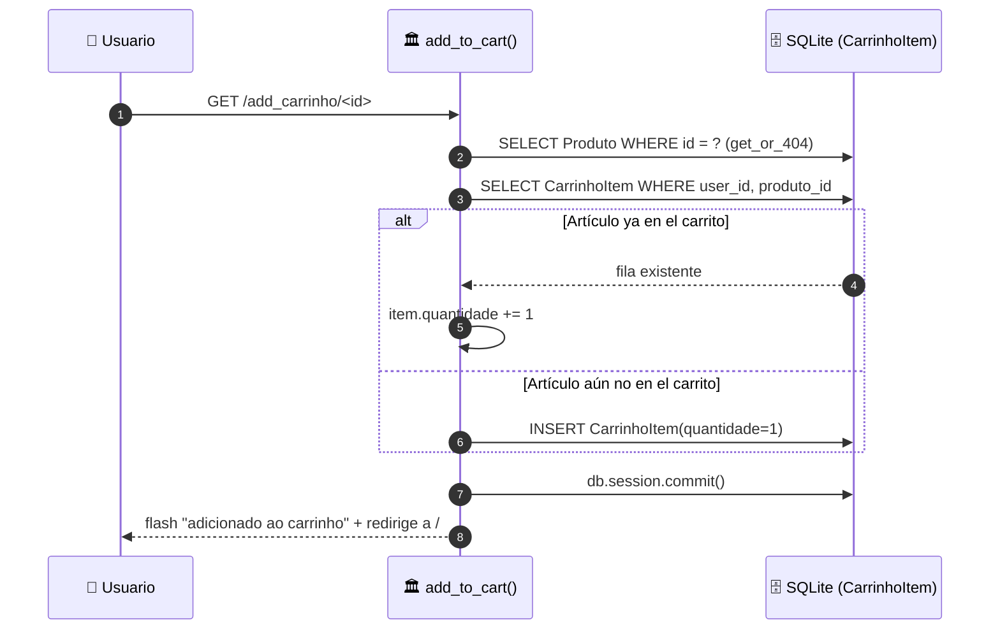
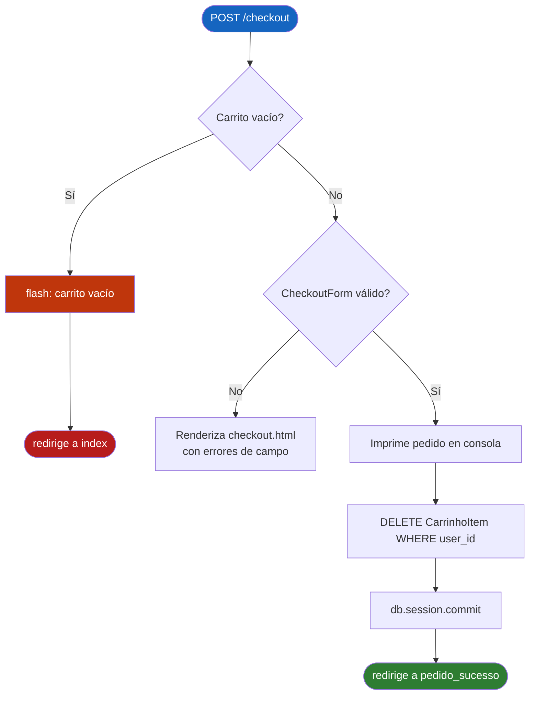
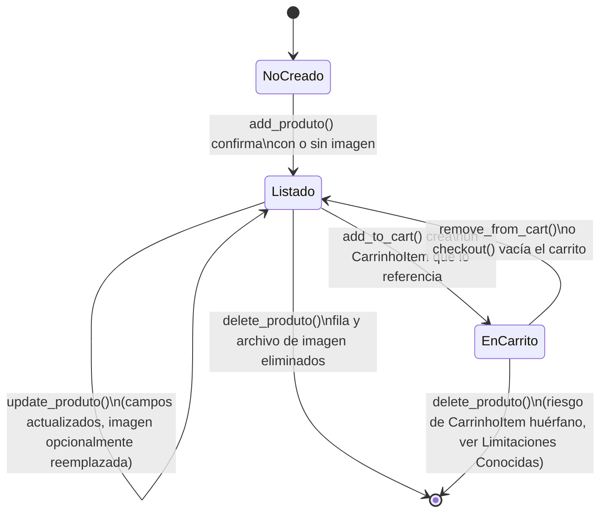
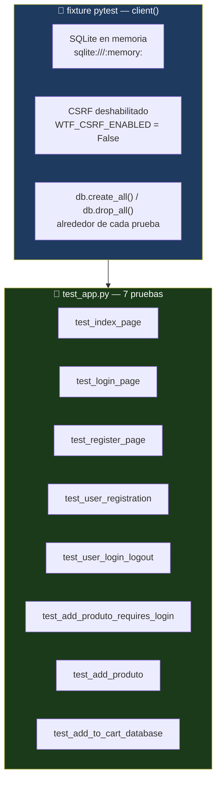

<div align="center">

**🌐 Choose Language / Selecione o Idioma / Elija el Idioma**

[](README.md)&nbsp;&nbsp;&nbsp;[](README_PT.md)&nbsp;&nbsp;&nbsp;[](README_ES.md)

</div>

---

<div align="center">

```
██╗      ██████╗      ██╗██╗███╗   ██╗██╗  ██╗ █████╗
██║     ██╔═══██╗     ██║██║████╗  ██║██║  ██║██╔══██╗
██║     ██║   ██║     ██║██║██╔██╗ ██║███████║███████║
██║     ██║   ██║██   ██║██║██║╚██╗██║██╔══██║██╔══██║
███████╗╚██████╔╝╚█████╔╝██║██║ ╚████║██║  ██║██║  ██║
╚══════╝ ╚═════╝  ╚════╝ ╚═╝╚═╝  ╚═══╝╚═╝  ╚═╝╚═╝  ╚═╝
       Una pequeña tienda local construida con Flask
```

---

[](https://www.python.org/)
[](https://flask.palletsprojects.com/)
[](https://flask-sqlalchemy.palletsprojects.com/)
[](https://www.sqlite.org/)
[](https://flask-wtf.readthedocs.io/)
[](https://getbootstrap.com/)
[](https://pytest.org/)

<br/>

> **Lojinha Local es una pequeña demo de e-commerce full-stack:**
> catálogo, carrito y checkout para una tienda local, protegida con contraseñas con hash y sesión de login.

<br/>


</div>

---

## 📑 Tabla de Contenidos

<details>
<summary>▶️ <strong>Haga clic para expandir / contraer esta sección</strong></summary>

<table>
<tr>
<td valign="top" width="50%">

**🏗️ Sistema**
- [Visión General](#-visión-general)
- [Arquitectura del Sistema](#-arquitectura-del-sistema)
- [Stack Tecnológico](#-stack-tecnológico)
- [Patrones de Diseño Aplicados](#-patrones-de-diseño-aplicados)
- [Estructura del Proyecto](#-estructura-del-proyecto)

**📦 Módulos**
- [Arranque de la Aplicación](#-arranque-de-la-aplicación--apppy)
- [Extensiones](#-extensiones--extensionspy)
- [Modelos de Datos](#-modelos-de-datos--modelspy)
- [Formularios](#-formularios--formspy)
- [Rutas de Autenticación](#-rutas-de-autenticación)
- [Rutas del Catálogo](#-rutas-del-catálogo)
- [Rutas de Carrito & Checkout](#-rutas-de-carrito--checkout)
- [Plantillas & Recursos Estáticos](#-plantillas--recursos-estáticos)

</td>
<td valign="top" width="50%">

**💼 Negocio**
- [Reglas de Negocio](#-reglas-de-negocio)
- [Requisitos Funcionales](#-requisitos-funcionales)
- [Requisitos No Funcionales](#-requisitos-no-funcionales)

**📐 Diseño**
- [Modelo de Datos](#-modelo-de-datos)
- [Flujos del Sistema](#-flujos-del-sistema)
- [Flujo de Registro & Login](#flujo-de-registro--login)
- [Flujo de Agregar al Carrito](#flujo-de-agregar-al-carrito)
- [Flujo de Checkout](#flujo-de-checkout)
- [Ciclo de Vida del Producto](#ciclo-de-vida-del-producto-máquina-de-estados)

**🔐 Seguridad & Operaciones**
- [Seguridad](#-seguridad)
- [Instalación & Ejecución](#-instalación--ejecución)
- [Pruebas Automatizadas](#-pruebas-automatizadas)
- [Métricas & Monitoreo](#-métricas--monitoreo)
- [Limitaciones Conocidas](#-limitaciones-conocidas)

</td>
</tr>
</table>

---

</details>

## 🌟 Visión General

<details>
<summary>▶️ <strong>Haga clic para expandir / contraer esta sección</strong></summary>

**Lojinha Local** es una demo de e-commerce full-stack escrita en **Python** con **Flask**. Implementa el ciclo esencial de una tienda en línea: un propietario autenticado gestiona un catálogo de productos, los visitantes lo navegan, agregan artículos a un carrito por usuario persistido en la base de datos, y completan un pedido mediante un formulario de checkout.

La aplicación es deliberadamente pequeña y monolítica: un único `app.py` define todas las rutas, `models.py` define tres modelos SQLAlchemy, `forms.py` define cuatro formularios `Flask-WTF`, y nueve plantillas Jinja2 extienden un `base.html` compartido, con estilo Bootstrap 5. No hay framework JavaScript, ninguna API REST ni estado del lado del cliente, cada interacción es un envío de formulario de página completa o navegación por enlace manejada en el servidor.

La persistencia usa **SQLite** a través de **Flask-SQLAlchemy**, las contraseñas se hashean con **Flask-Bcrypt**, y la protección CSRF en cada formulario la provee **Flask-WTF**. Las imágenes de producto se suben a `static/uploads/` con nombres de archivo aleatorios para evitar colisiones y path traversal a partir de nombres proporcionados por el usuario.

### 🎯 Objetivos del Sistema

| Objetivo | Descripción |
|-----------|-------------|
| 👤 **Cuentas de Usuario** | Permitir que los visitantes se registren e inicien sesión con contraseña hasheada antes de gestionar la tienda |
| 🛍️ **Catálogo de Productos** | Mostrar cada producto en la página principal con imagen, nombre, descripción y precio |
| ➕ **Gestión del Catálogo** | Permitir que usuarios autenticados creen, editen y eliminen productos, incluyendo la carga de imágenes |
| 🛒 **Carrito Persistente** | Mantener un carrito de compras por usuario en la base de datos, no en la sesión, para que sobreviva a nuevos inicios de sesión |
| 💳 **Checkout** | Recopilar el nombre, correo electrónico y dirección del cliente, vaciar el carrito y confirmar el pedido |
| 🖼️ **Manejo de Imágenes** | Almacenar imágenes subidas con nombres de archivo aleatorios y eliminar el archivo antiguo cuando una imagen se reemplaza o el producto se elimina |
| 🔐 **Control de Acceso** | Proteger cada ruta que modifica estado (`add`, `edit`, `delete`, carrito, checkout) detrás del decorador `login_required` |
| 🧪 **Verificabilidad** | Incluir una suite automatizada de `pytest` que cubre registro, login/logout, creación de productos y persistencia del carrito |

---

</details>

## 🏗️ Arquitectura del Sistema

<details>
<summary>▶️ <strong>Haga clic para expandir / contraer esta sección</strong></summary>

### Diagrama de Módulos



### Capas de la Arquitectura



---

</details>

## 🛠️ Stack Tecnológico

<details>
<summary>▶️ <strong>Haga clic para expandir / contraer esta sección</strong></summary>

<table>
<thead>
<tr>
<th>Capa</th>
<th>Tecnología</th>
<th>Versión</th>
<th>Propósito</th>
</tr>
</thead>
<tbody>
<tr>
<td rowspan="2"><strong>🧠 Lenguaje</strong></td>
<td>Python</td>
<td>3.x</td>
<td>Lenguaje de origen de la aplicación</td>
</tr>
<tr>
<td>Jinja2</td>
<td>incluido con Flask</td>
<td>Plantillas HTML en el servidor</td>
</tr>
<tr>
<td rowspan="4"><strong>🌐 Framework Web</strong></td>
<td>Flask</td>
<td>sin versión fijada (<code>requirements.txt</code>)</td>
<td>Aplicación WSGI, enrutamiento, ciclo de solicitud/respuesta</td>
</tr>
<tr>
<td>Flask-WTF</td>
<td>sin versión fijada</td>
<td>Objetos de formulario, protección CSRF</td>
</tr>
<tr>
<td>WTForms</td>
<td>incluido con Flask-WTF</td>
<td>Tipos de campo y validadores (<code>DataRequired</code>, <code>Email</code>, <code>EqualTo</code>...)</td>
</tr>
<tr>
<td>email_validator</td>
<td>sin versión fijada</td>
<td>Respalda el validador <code>Email()</code> usado por <code>CheckoutForm</code></td>
</tr>
<tr>
<td rowspan="2"><strong>💾 Persistencia</strong></td>
<td>Flask-SQLAlchemy</td>
<td>sin versión fijada</td>
<td>Capa ORM sobre <code>db.Model</code> (<code>User</code>, <code>Produto</code>, <code>CarrinhoItem</code>)</td>
</tr>
<tr>
<td>SQLite</td>
<td>motor incluido con Python</td>
<td>Base de datos relacional basada en archivo, <code>instance/lojinha.db</code></td>
</tr>
<tr>
<td rowspan="1"><strong>🔐 Seguridad</strong></td>
<td>Flask-Bcrypt</td>
<td>sin versión fijada</td>
<td>Hash de contraseña (<code>generate_password_hash</code> / <code>check_password_hash</code>)</td>
</tr>
<tr>
<td rowspan="3"><strong>🎨 Frontend</strong></td>
<td>Bootstrap</td>
<td>5.3.2 (CDN)</td>
<td>Layout, tarjetas, formularios, navbar, alertas</td>
</tr>
<tr>
<td>Bootstrap Icons</td>
<td>1.11.1 (CDN)</td>
<td>Íconos de carrito, persona y papelera en la navbar y la tabla del carrito</td>
</tr>
<tr>
<td>CSS Personalizado</td>
<td><code>static/style.css</code></td>
<td>Animación de hover en tarjeta, pie de página fijo, color del precio</td>
</tr>
<tr>
<td rowspan="1"><strong>🧪 Pruebas</strong></td>
<td>pytest</td>
<td>sin versión fijada</td>
<td>Pruebas funcionales sobre el cliente de prueba de Flask, <code>test_app.py</code></td>
</tr>
</tbody>
</table>

> [!NOTE]
> `requirements.txt` no fija números de versión (`Flask`, `Flask-SQLAlchemy`, `Flask-Bcrypt`, `Flask-WTF`, `pytest`, `email_validator`), por lo que las versiones efectivamente resueltas dependen de lo que `pip` instale en el momento de la configuración. Solo los recursos de frontend cargados vía CDN (Bootstrap, Bootstrap Icons) llevan versiones explícitas, tomadas directamente de `templates/base.html`.

---

</details>

## 🎨 Patrones de Diseño Aplicados

<details>
<summary>▶️ <strong>Haga clic para expandir / contraer esta sección</strong></summary>

| Patrón | Dónde | Justificación |
|---------|-------|-----------|
| 🧭 **Application Factory (parcial)** | `app = Flask(__name__)` + `db.init_app(app)` / `bcrypt.init_app(app)` en `app.py` | Las extensiones se instancian en `extensions.py` y se vinculan después, evitando importaciones circulares entre `models.py` y `app.py` |
| 🚦 **Decorator / Guard Clause** | `login_required` en `app.py` | Centraliza la verificación "debe estar autenticado" en lugar de repetirla en cada vista |
| 🗂️ **Active Record (vía ORM)** | `User`, `Produto`, `CarrinhoItem` en `models.py` | Cada modelo envuelve su propia tabla y relaciones, siguiendo cómo `Flask-SQLAlchemy` expone `db.Model` |
| 📝 **Form Object** | `RegistrationForm`, `LoginForm`, `ProdutoForm`, `CheckoutForm` en `forms.py` | Las reglas de validación y definiciones de campo se declaran una vez y se reutilizan entre `GET`/`POST` |
| 🧩 **Herencia de Plantillas** | `` en cada plantilla de página | Navbar, mensajes flash y pie de página se definen una sola vez en `base.html` |
| 🔁 **Extracción de Helper** | `save_picture()`, `get_cart_details()` en `app.py` | La lógica repetida (persistencia de archivo, agregación de carrito) se extrae de los manejadores de rutas |
| 🏷️ **Validador Personalizado** | `RegistrationForm.validate_username` | La convención de WTForms de métodos `validate_<campo>` garantiza la unicidad del nombre de usuario contra la base de datos |
| 🔀 **Strategy (implícito)** | `ver_carrinho()` vs `get_cart_details()` | Existen dos estrategias similares de agregación de carrito, una para visualización (dict con datos completos) y otra para checkout (solo nombre + cantidad) |

---

</details>

## 📁 Estructura del Proyecto

<details>
<summary>▶️ <strong>Haga clic para expandir / contraer esta sección</strong></summary>

```
lojinha_local/
│
├── 📄 app.py                       # App Flask, las 15 rutas, save_picture(), login_required
├── 📄 extensions.py                # Instancias compartidas de SQLAlchemy `db` y Bcrypt `bcrypt`
├── 📄 models.py                    # Modelos SQLAlchemy User, Produto, CarrinhoItem
├── 📄 forms.py                     # RegistrationForm, LoginForm, ProdutoForm, CheckoutForm
├── 📄 test_app.py                  # Suite pytest (7 pruebas) sobre el cliente de prueba de Flask
├── 📄 requirements.txt             # Flask, Flask-SQLAlchemy, Flask-Bcrypt, Flask-WTF, pytest, email_validator
├── 📄 .gitignore                   # Excluye secretos, *.db, cachés, venvs
├── 📄 produtos.db                  # Archivo SQLite obsoleto/suelto en la raíz (no usado por app.py)
│
├── 📂 instance/
│   └── 📄 lojinha.db               # Base de datos SQLite activa (SQLALCHEMY_DATABASE_URI)
│
├── 📂 images/                      # Fotos de producto de referencia/semilla (no servidas por Flask)
│   ├── download.jpg
│   ├── images.jpg
│   ├── vitaminico.jpg
│   └── whey_1kg.jpg
│
├── 📂 static/
│   ├── 📄 style.css                # Hover de tarjeta, pie de página fijo, color de precio (servido en /static/style.css)
│   └── 📂 uploads/                 # Imágenes de producto subidas, nombres con 16 caracteres hex aleatorios
│       ├── 00c736fb18612e1c.jpg
│       ├── 3d1cc0a715767b0e.jpg
│       ├── a8d1f22085501241.jpg
│       ├── bb87983865f6ae47.jpg
│       └── d89f03ba49bf53f4.jpg
│
├── 📂 templates/
│   ├── 📄 base.html                # Layout compartido: navbar, mensajes flash, pie de página
│   ├── 📄 index.html               # Cuadrícula del catálogo de productos
│   ├── 📄 login.html               # Formulario de login
│   ├── 📄 register.html            # Formulario de registro
│   ├── 📄 adicionar_produto.html   # Formulario de agregar producto (multipart, carga de imagen)
│   ├── 📄 editar_produto.html      # Formulario de editar producto, precargado vía `obj=produto`
│   ├── 📄 carrinho.html            # Tabla del carrito con subtotal/total y enlaces de eliminación
│   ├── 📄 checkout.html            # Resumen del pedido + CheckoutForm
│   └── 📄 pedido_sucesso.html      # Página de confirmación del pedido
│
├── 📄 README.md                    # 🇺🇸 English (primario)
├── 📄 README_PT.md                 # 🇧🇷 Português
└── 📄 README_ES.md                 # 🇪🇸 Español
```

---

</details>

## 📦 Módulos del Sistema

<details>
<summary>▶️ <strong>Haga clic para expandir / contraer esta sección</strong></summary>

### 🏛️ Arranque de la Aplicación — `app.py`

El punto de entrada. Crea la aplicación `Flask`, configura `SECRET_KEY`, `instance_path`, `SQLALCHEMY_DATABASE_URI`, `UPLOAD_FOLDER` y `MAX_CONTENT_LENGTH`, y luego vincula las dos extensiones compartidas y registra las 15 rutas.

| Responsabilidad | Implementación |
|-----------------|----------------|
| Configuración | `app.config['SQLALCHEMY_DATABASE_URI'] = 'sqlite:///lojinha.db'` (resuelto dentro de `instance/`) |
| Directorio de carga | `app.config['UPLOAD_FOLDER'] = os.path.join(app.root_path, 'static', 'uploads')`, creado con `os.makedirs(..., exist_ok=True)` |
| Límite de tamaño de carga | `app.config['MAX_CONTENT_LENGTH'] = 16 * 1024 * 1024` (16 MB) |
| Vinculación de extensiones | `db.init_app(app)`, `bcrypt.init_app(app)` |
| Punto de entrada de desarrollo | `if __name__ == '__main__': db.create_all(); app.run(debug=True)` |

---

### 🔌 Extensiones — `extensions.py`

Un módulo de dos líneas que existe puramente para romper la importación circular entre `app.py` (que necesita `db` para configurar la aplicación) y `models.py` (que necesita `db.Model` para declarar tablas).

| Objeto | Tipo | Propósito |
|--------|------|---------|
| `db` | `flask_sqlalchemy.SQLAlchemy()` | Instancia ORM compartida, vinculada en `app.py`, importada por `models.py` |
| `bcrypt` | `flask_bcrypt.Bcrypt()` | Instancia de hash compartida, vinculada en `app.py`, usada en `register()` y `login()` |

---

### 🗂️ Modelos de Datos — `models.py`

Tres clases `db.Model` sin `__init__` ni `__repr__` personalizados, apoyándose enteramente en los valores predeterminados de `Flask-SQLAlchemy`.

| Modelo | Columnas | Relaciones |
|-------|---------|---------------|
| `User` | `id`, `username` (único), `password` (hash bcrypt) | `carrinho_itens` — uno a muchos con `CarrinhoItem`, `cascade="all, delete-orphan"` |
| `Produto` | `id`, `nome`, `descricao` (opcional), `preco` (`Float`), `imagem` (predeterminado `'default.jpg'`) | referenciado por `CarrinhoItem.produto_id` |
| `CarrinhoItem` | `id`, `quantidade` (predeterminado `1`), `user_id` (FK), `produto_id` (FK) | `produto` — `db.relationship('Produto')`; `user` backref creado desde `User.carrinho_itens` |

---

### 📝 Formularios — `forms.py`

Cuatro subclases de `FlaskForm`, cada una asociada uno a uno con una ruta.

| Formulario | Campos | Validadores clave |
|------|--------|-----------------|
| `RegistrationForm` | `username`, `password`, `confirm_password`, `submit` | `Length(min=4, max=150)` en el username, `Length(min=6)` en la contraseña, `EqualTo('password')` en la confirmación, verificación de unicidad personalizada `validate_username` |
| `LoginForm` | `username`, `password`, `submit` | `DataRequired()` en ambos campos |
| `ProdutoForm` | `nome`, `descricao`, `preco`, `imagem`, `submit_add`, `submit_update` | `Length(max=100)` en el nombre, `NumberRange(min=0.01)` en el precio, `FileAllowed(['jpg','png','jpeg'])` en la imagen |
| `CheckoutForm` | `nomeCompleto`, `email`, `endereco`, `submit` | `Email()` en el correo, `Length(min=10)` en la dirección |

---

### 🔐 Rutas de Autenticación

| Ruta | Métodos | Manejador | Comportamiento |
|-------|---------|---------|----------|
| `/register` | `GET`, `POST` | `register()` | Hashea la contraseña con `bcrypt.generate_password_hash`, crea un `User`, redirige a `/login` |
| `/login` | `GET`, `POST` | `login()` | Busca `User` por username, verifica con `bcrypt.check_password_hash`, almacena `user_id`/`username` en la `session` |
| `/logout` | `GET` | `logout()` | `login_required`; elimina `user_id`/`username` de la `session` |

---

### 🛍️ Rutas del Catálogo

| Ruta | Métodos | Manejador | Comportamiento |
|-------|---------|---------|----------|
| `/` | `GET` | `index()` | Lista todos los `Produto` en la página principal |
| `/adicionar_produto` | `GET`, `POST` | `add_produto()` | `login_required`; guarda la imagen subida vía `save_picture()`, crea un `Produto` |
| `/editar_produto/<int:id>` | `GET`, `POST` | `update_produto()` | `login_required`; `Produto.query.get_or_404(id)`, reemplaza el archivo de imagen y elimina el anterior si se sube uno nuevo |
| `/excluir_produto/<int:id>` | `GET` | `delete_produto()` | `login_required`; elimina el archivo de imagen del disco (a menos que sea `'default.jpg'`) y la fila `Produto` |

---

### 🛒 Rutas de Carrito & Checkout

| Ruta | Métodos | Manejador | Comportamiento |
|-------|---------|---------|----------|
| `/add_carrinho/<int:id>` | `GET` | `add_to_cart()` | `login_required`; incrementa `quantidade` si ya existe un `CarrinhoItem` para ese usuario/producto, si no crea uno |
| `/remover_carrinho/<int:id>` | `GET` | `remove_from_cart()` | `login_required`; elimina la fila `CarrinhoItem` correspondiente |
| `/carrinho` | `GET` | `ver_carrinho()` | `login_required`; construye un dict de visualización con nombre, precio, cantidad y subtotal por artículo, más el total general |
| `/checkout` | `GET`, `POST` | `checkout()` | `login_required`; redirige a `/` si el carrito está vacío; al enviar un `CheckoutForm` válido, limpia las filas `CarrinhoItem` del usuario y redirige a `/pedido_sucesso` |
| `/pedido_sucesso` | `GET` | `pedido_sucesso()` | `login_required`; renderiza la página estática de confirmación |

---

### 🖼️ Plantillas & Recursos Estáticos

| Recurso | Rol |
|-------|------|
| `templates/base.html` | Navbar Bootstrap con enlaces condicionales de login/carrito/logout, renderizado de mensajes flash, pie de página |
| `templates/index.html` | Cuadrícula de tarjetas iterando `produtos`, con acciones de agregar al carrito / editar / eliminar por tarjeta |
| `templates/carrinho.html` | Tabla de los artículos de `display_cart` con acción de eliminación y total calculado |
| `templates/checkout.html` | Diseño de dos columnas: resumen del pedido a partir de `display_order` más el `CheckoutForm` |
| `static/style.css` | Transformación de hover en tarjeta, precio verde en negrita, pie de página fijo |

---

</details>

## 💼 Reglas de Negocio

<details>
<summary>▶️ <strong>Haga clic para expandir / contraer esta sección</strong></summary>

### 👤 Reglas de Cuenta

| # | Regla | Aplicación |
|---|------|-------------|
| RN-01 | Los nombres de usuario deben ser únicos | `RegistrationForm.validate_username` consulta `User` antes de permitir el envío |
| RN-02 | Los nombres de usuario deben tener entre 4 y 150 caracteres | `Length(min=4, max=150)` en `RegistrationForm.username` |
| RN-03 | Las contraseñas deben tener al menos 6 caracteres | `Length(min=6)` en `RegistrationForm.password` |
| RN-04 | La confirmación de contraseña debe coincidir con la contraseña | `EqualTo('password')` en `confirm_password` |
| RN-05 | Las contraseñas nunca se almacenan en texto plano | `bcrypt.generate_password_hash` antes de `db.session.add(user)` |

### 🛍️ Reglas del Catálogo

| # | Regla | Aplicación |
|---|------|-------------|
| RN-06 | El precio de un producto debe ser estrictamente positivo | `NumberRange(min=0.01)` en `ProdutoForm.preco` |
| RN-07 | Las imágenes subidas deben ser JPG, PNG o JPEG | `FileAllowed(['jpg', 'png', 'jpeg'])` en `ProdutoForm.imagem` |
| RN-08 | Reemplazar la imagen de un producto elimina el archivo anterior, salvo que sea la predeterminada | `if produto.imagem and produto.imagem != 'default.jpg': os.remove(...)` en `update_produto()` |
| RN-09 | Eliminar un producto elimina su archivo de imagen, salvo que sea la predeterminada | Misma verificación en `delete_produto()` |
| RN-10 | Los nombres de archivo subidos son aleatorizados para evitar colisiones | `save_picture()` usa `secrets.token_hex(8)` más la extensión original |

### 🛒 Reglas de Carrito & Checkout

| # | Regla | Aplicación |
|---|------|-------------|
| RN-11 | Agregar un producto ya en el carrito incrementa la cantidad en vez de duplicar la fila | `add_to_cart()` verifica `CarrinhoItem.query.filter_by(user_id=..., produto_id=...).first()` |
| RN-12 | El carrito está restringido al usuario autenticado | Toda consulta de carrito filtra por `session['user_id']` |
| RN-13 | El checkout se bloquea cuando el carrito está vacío | `if not display_order: flash(...); return redirect(url_for('index'))` |
| RN-14 | Un checkout exitoso vacía el carrito | `CarrinhoItem.query.filter_by(user_id=user_id).delete()` dentro de `checkout()` |
| RN-15 | Eliminar un `User` propaga la eliminación de los artículos de su carrito | `cascade="all, delete-orphan"` en `User.carrinho_itens` |

### 🔐 Reglas de Acceso

| # | Regla | Aplicación |
|---|------|-------------|
| RN-16 | Toda ruta que modifica datos o expone datos personales requiere sesión activa | `@login_required` en `add_produto`, `update_produto`, `delete_produto`, `add_to_cart`, `remove_from_cart`, `ver_carrinho`, `checkout`, `pedido_sucesso`, `logout` |
| RN-17 | Un visitante no autenticado es redirigido a `/login` con un mensaje flash | Cuerpo del decorador `login_required` |

---

</details>

## ✅ Requisitos Funcionales

<details>
<summary>▶️ <strong>Haga clic para expandir / contraer esta sección</strong></summary>

| ID | Requisito | Prioridad | Estado |
|----|-------------|----------|--------|
| **RF-01** | El sistema debe permitir que un visitante se registre con nombre de usuario y contraseña únicos | 🔴 Alta | ✅ Implementado |
| **RF-02** | El sistema debe rechazar el registro si el nombre de usuario ya existe | 🔴 Alta | ✅ Implementado |
| **RF-03** | El sistema debe permitir que un usuario registrado inicie sesión con nombre de usuario y contraseña | 🔴 Alta | ✅ Implementado |
| **RF-04** | El sistema debe permitir que un usuario autenticado cierre sesión | 🟡 Media | ✅ Implementado |
| **RF-05** | El sistema debe listar todos los productos en la página principal | 🔴 Alta | ✅ Implementado |
| **RF-06** | El sistema debe permitir que un usuario autenticado agregue un nuevo producto con nombre, descripción, precio e imagen opcional | 🔴 Alta | ✅ Implementado |
| **RF-07** | El sistema debe permitir que un usuario autenticado edite un producto existente | 🔴 Alta | ✅ Implementado |
| **RF-08** | El sistema debe permitir que un usuario autenticado elimine un producto | 🟡 Media | ✅ Implementado |
| **RF-09** | El sistema debe eliminar el archivo de imagen asociado cuando un producto se elimina o su imagen se reemplaza | 🟡 Media | ✅ Implementado |
| **RF-10** | El sistema debe permitir que un usuario autenticado agregue un producto a su carrito | 🔴 Alta | ✅ Implementado |
| **RF-11** | El sistema debe incrementar la cantidad cuando el mismo producto se agrega de nuevo | 🟡 Media | ✅ Implementado |
| **RF-12** | El sistema debe permitir que un usuario elimine un artículo de su carrito | 🟡 Media | ✅ Implementado |
| **RF-13** | El sistema debe mostrar el carrito con precio unitario, cantidad, subtotal y total general | 🔴 Alta | ✅ Implementado |
| **RF-14** | El sistema debe bloquear el checkout cuando el carrito está vacío | 🟡 Media | ✅ Implementado |
| **RF-15** | El sistema debe recopilar nombre completo, correo electrónico y dirección en el checkout | 🔴 Alta | ✅ Implementado |
| **RF-16** | El sistema debe validar el formato del correo electrónico en el checkout | 🟡 Media | ✅ Implementado |
| **RF-17** | El sistema debe vaciar el carrito después de un checkout exitoso | 🔴 Alta | ✅ Implementado |
| **RF-18** | El sistema debe mostrar una página de confirmación de pedido después del checkout | 🟢 Baja | ✅ Implementado |
| **RF-19** | El sistema debe mostrar retroalimentación flash para cada acción de crear/editar/eliminar/login/logout | 🟢 Baja | ✅ Implementado |
| **RF-20** | El sistema debe proteger cada ruta que modifica estado mediante autenticación | 🔴 Alta | ✅ Implementado |
| **RF-21** | El sistema debe persistir el envío del checkout (nombre, correo) más allá de un registro en consola | 🟡 Media | ⬜ Planificado |
| **RF-22** | El sistema debe permitir que un usuario cambie la cantidad de un artículo del carrito directamente | 🟢 Baja | ⬜ Planificado |

---

</details>

## ⚡ Requisitos No Funcionales

<details>
<summary>▶️ <strong>Haga clic para expandir / contraer esta sección</strong></summary>

| ID | Categoría | Requisito | Objetivo |
|----|----------|-------------|--------|
| **RNF-01** | 🔐 Seguridad | Las contraseñas nunca deben almacenarse ni registrarse en texto plano | 100% de las contraseñas almacenadas son hashes bcrypt |
| **RNF-02** | 🔐 Seguridad | Cada envío de formulario debe llevar un token CSRF | Garantizado vía `hidden_tag()` de `Flask-WTF` en los 4 formularios |
| **RNF-03** | 📦 Seguridad de Carga | Los archivos subidos deben tener un límite de tamaño | `MAX_CONTENT_LENGTH = 16 * 1024 * 1024` (16 MB) |
| **RNF-04** | 📦 Seguridad de Carga | Las imágenes de producto subidas deben restringirse a tipos seguros | `FileAllowed(['jpg', 'png', 'jpeg'])` |
| **RNF-05** | 🗂️ Integridad de Datos | Toda fila de carrito debe referenciar un usuario y producto válidos | `ForeignKey('user.id')`, `ForeignKey('produto.id')` con `nullable=False` |
| **RNF-06** | ⚡ Rendimiento | La agregación del carrito debe evitar consultas N+1 | `options(db.joinedload(CarrinhoItem.produto))` en `ver_carrinho()` y `get_cart_details()` |
| **RNF-07** | 🎨 Usabilidad | La interfaz debe renderizar correctamente en móvil y escritorio | Clases de cuadrícula responsiva de Bootstrap 5 (`col-md-4`, `row g-5`, etc.) |
| **RNF-08** | 🎨 Usabilidad | Toda acción destructiva debe pedir confirmación | `onclick="return confirm(...)"` en el enlace de eliminar producto |
| **RNF-09** | 🌍 Internacionalización | Los textos e mensajes flash están en un único idioma | Todas las cadenas actualmente fijas en portugués de Brasil |
| **RNF-10** | 🧱 Mantenibilidad | El chrome de UI compartido debe vivir en un solo lugar | Herencia de `base.html` en las 8 plantillas de página |
| **RNF-11** | 🧱 Mantenibilidad | Las instancias ORM deben definirse una vez para evitar importaciones circulares | Centralizado en `extensions.py` |
| **RNF-12** | 🧪 Testabilidad | Los flujos principales deben estar cubiertos por una suite de pruebas automatizada | `test_app.py`, 7 pruebas sobre el cliente de prueba de Flask |
| **RNF-13** | 🔧 Configurabilidad | La ubicación de la base de datos y la carpeta de carga deben ser resolubles relativamente a la app | `app.instance_path`, `app.root_path` usados en lugar de rutas absolutas fijas |
| **RNF-14** | 💾 Portabilidad | El motor de base de datos no debe requerir un servidor externo | Archivo SQLite en `instance/lojinha.db` |
| **RNF-15** | ♿ Accesibilidad | Los campos de formulario deben llevar elementos `<label>` asociados | `form.<campo>.label(...)` renderizado antes de cada input en todas las plantillas de formulario |

---

</details>

## 🗄️ Modelo de Datos

<details>
<summary>▶️ <strong>Haga clic para expandir / contraer esta sección</strong></summary>

### Diagrama Entidad-Relación



### Detalle del Esquema

| Tabla | Columna | Tipo | Restricciones |
|-------|--------|------|-------------|
| `user` | `id` | `Integer` | Clave primaria |
| `user` | `username` | `String(150)` | Único, no nulo |
| `user` | `password` | `String(150)` | No nulo, hash bcrypt |
| `produto` | `id` | `Integer` | Clave primaria |
| `produto` | `nome` | `String(100)` | No nulo |
| `produto` | `descricao` | `Text` | Opcional |
| `produto` | `preco` | `Float` | No nulo |
| `produto` | `imagem` | `String(300)` | Opcional, predeterminado `'default.jpg'` |
| `carrinho_item` | `id` | `Integer` | Clave primaria |
| `carrinho_item` | `quantidade` | `Integer` | No nulo, predeterminado `1` |
| `carrinho_item` | `user_id` | `Integer` | Clave foránea → `user.id`, no nulo |
| `carrinho_item` | `produto_id` | `Integer` | Clave foránea → `produto.id`, no nulo |

### Ubicaciones de Almacenamiento

| Aspecto | Ubicación | Notas |
|---------|----------|-------|
| Datos relacionales | `instance/lojinha.db` | Creado por `db.create_all()` en la primera ejecución, dentro del contexto de la aplicación Flask |
| Imágenes subidas | `static/uploads/<16-hex>.<ext>` | Nombre de archivo generado por `secrets.token_hex(8)` en `save_picture()` |
| Archivo de base de datos suelto | `produtos.db` (raíz del repositorio) | Presente en el repositorio, pero no referenciado por `SQLALCHEMY_DATABASE_URI`, parece ser un resto de una configuración anterior |

---

</details>

## 🔄 Flujos del Sistema

<details>
<summary>▶️ <strong>Haga clic para expandir / contraer esta sección</strong></summary>

### Flujo de Registro & Login



### Flujo de Agregar al Carrito



### Flujo de Checkout



### Ciclo de Vida del Producto (Máquina de Estados)



---

</details>

## 🔐 Seguridad

<details>
<summary>▶️ <strong>Haga clic para expandir / contraer esta sección</strong></summary>

### Controles Implementados

| Control | Implementación | Efecto |
|---------|---------------|--------|
| 🔐 **Hash de contraseña** | `flask_bcrypt.Bcrypt` en `extensions.py`, usado por `register()`/`login()` | Las contraseñas en texto plano nunca se persisten |
| 🛡️ **Protección CSRF** | `hidden_tag()` de `Flask-WTF` renderizado en cada plantilla de formulario | La falsificación de solicitud entre sitios se rechaza sin un token válido |
| 🚦 **Autorización a nivel de ruta** | Decorador `login_required` en 9 rutas | Las solicitudes no autenticadas a rutas protegidas se redirigen, no se ejecutan |
| 🧾 **Validación en el servidor** | Validadores WTForms (`DataRequired`, `Length`, `Email`, `EqualTo`, `NumberRange`, `FileAllowed`) | Las entradas mal formadas se rechazan antes de llegar a la base de datos |
| 📦 **Límite de tamaño de carga** | `MAX_CONTENT_LENGTH = 16 * 1024 * 1024` | Las cargas demasiado grandes son rechazadas por Flask antes de llegar a la vista |
| 🖼️ **Aleatorización de nombre de archivo** | `save_picture()` usa `secrets.token_hex(8)` | Los nombres de archivo proporcionados por el usuario nunca llegan directamente al sistema de archivos, mitigando path traversal |
| 🗂️ **Consultas restringidas** | Toda consulta de carrito filtra por `session['user_id']` | Un usuario no puede leer ni modificar el carrito de otro usuario a través de las rutas expuestas |

### Limitaciones de Seguridad Conocidas

> [!WARNING]
> Las siguientes limitaciones son inherentes al diseño actual y deben entenderse antes de cualquier uso en producción.

| Limitación | Riesgo | Camino de mitigación |
|------------|------|-----------------|
| 🔑 **`SECRET_KEY` fija en el código** | `app.config['SECRET_KEY'] = 'sua_chave_secreta_muito_segura'` está confirmada en `app.py` | Cargar la clave desde una variable de entorno, nunca confirmarla en el repositorio |
| 🐛 **`debug=True` en el punto de entrada** | `app.run(debug=True)` expone el depurador interactivo de Werkzeug si es accesible desde fuera de localhost | Deshabilitar el modo debug fuera del desarrollo local, usar una bandera de entorno |
| 🧍 **Sin verificación de propiedad en los productos** | Cualquier usuario autenticado puede editar o eliminar cualquier producto, no solo los propios | Agregar un `owner_id` en `Produto` y verificarlo en `update_produto`/`delete_produto` |
| 🗂️ **Sin limitación de tasa en login/registro** | Los intentos de fuerza bruta contra credenciales no están limitados | Agregar `Flask-Limiter` o un límite de tasa en el proxy inverso |
| 📝 **Los datos del pedido solo se imprimen en consola** | `checkout()` usa `print(...)`, por lo que el nombre/correo enviados no se almacenan de forma duradera ni auditable | Persistir los pedidos en un modelo `Pedido` dedicado |
| 🖼️ **Extensión del archivo confiada a la indicación MIME del cliente** | `FileAllowed` verifica la extensión, no los bytes reales del contenido del archivo | Validar magic bytes / recodificar la imagen en el servidor |
| 🍪 **Cookie de sesión con valores predeterminados de Flask** | Ninguna configuración explícita de `SESSION_COOKIE_SECURE` / `SESSION_COOKIE_HTTPONLY` en `app.py` | Definir esas banderas explícitamente, especialmente antes de desplegar sobre HTTPS |

---

</details>

## 🚀 Instalación & Ejecución

<details>
<summary>▶️ <strong>Haga clic para expandir / contraer esta sección</strong></summary>

### Prerrequisitos

```bash
# Python 3.x con pip
python --version
pip --version
```

### Build

```bash
# Clone o ingrese al directorio del proyecto
cd lojinha_local

# (Recomendado) cree y active un entorno virtual
python -m venv venv
# Windows:
venv\Scripts\activate
# macOS/Linux:
source venv/bin/activate

# Instale las dependencias
pip install -r requirements.txt
```

### Ejecución

```bash
# Ejecute el servidor de desarrollo (crea instance/lojinha.db en la primera ejecución)
python app.py
# Flask inicia en modo debug en http://127.0.0.1:5000/
```

**Uso dentro de la aplicación**

1. Abra `http://127.0.0.1:5000/` — el catálogo se carga vacío en la primera ejecución.
2. Haga clic en **Cadastro** y cree una cuenta (username de 4+ caracteres, contraseña de 6+ caracteres).
3. Inicie sesión, luego haga clic en **Adicionar Produto** para crear el primer producto (nombre, precio, imagen opcional).
4. Desde la página principal, use **Adicionar ao Carrinho** en cualquier tarjeta de producto.
5. Abra **Carrinho** para revisar cantidades y el total, luego **Finalizar Compra**.
6. Complete nombre, correo y dirección, envíe, y llegue a la página de confirmación del pedido.

### Scripts & Objetivos

| Comando | Propósito |
|---------|---------|
| `python app.py` | Ejecuta el servidor de desarrollo, con `db.create_all()` ejecutado al iniciar |
| `pip install -r requirements.txt` | Instala Flask, Flask-SQLAlchemy, Flask-Bcrypt, Flask-WTF, pytest, email_validator |
| `pytest` | Ejecuta la suite de pruebas automatizada (`test_app.py`) |
| `pytest -v` | Ejecuta las pruebas con salida detallada por prueba |

### Referencia de Configuración

| Configuración | Valor | Declarado en |
|---------|-------|-------------|
| `SECRET_KEY` | cadena fija en el código | `app.py` |
| `SQLALCHEMY_DATABASE_URI` | `sqlite:///lojinha.db` | `app.py` (resuelto contra `instance_path`) |
| `UPLOAD_FOLDER` | `static/uploads/` | `app.py` |
| `MAX_CONTENT_LENGTH` | `16 * 1024 * 1024` (16 MB) | `app.py` |
| `debug` | `True` | `app.run(debug=True)` en `app.py` |

---

</details>

## 🧪 Pruebas Automatizadas

<details>
<summary>▶️ <strong>Haga clic para expandir / contraer esta sección</strong></summary>

### Arquitectura de Pruebas



| Prueba | Verifica |
|------|----------|
| `test_index_page` | `/` retorna 200 y renderiza "Nossos Produtos" |
| `test_login_page` | `/login` retorna 200 y renderiza "Login" |
| `test_register_page` | `/register` retorna 200 y renderiza "Cadastro" |
| `test_user_registration` | El registro es exitoso y la fila `User` existe después |
| `test_user_login_logout` | El login establece `session['user_id']`, el logout lo limpia |
| `test_add_produto_requires_login` | `GET /adicionar_produto` sin autenticación redirige al flash de login |
| `test_add_produto` | La creación de producto autenticada persiste un `Produto` con el precio correcto |
| `test_add_to_cart_database` | `add_to_cart` persiste un `CarrinhoItem` con `quantidade == 1` |

### Ejecutando las Pruebas

```bash
# Ejecuta la suite completa
pytest

# Ejecuta con salida detallada
pytest -v

# Ejecuta una sola prueba
pytest test_app.py::test_user_login_logout
```

### Lista de Verificación de Aceptación Manual

| # | Escenario | Resultado esperado |
|---|----------|------------------|
| 1 | Registrarse con un nombre de usuario de menos de 4 caracteres | El formulario se vuelve a renderizar con un error de validación de longitud |
| 2 | Registrarse con un nombre de usuario duplicado | El formulario se vuelve a renderizar con "Esse nome de usuário já existe" |
| 3 | Iniciar sesión con contraseña incorrecta | Se muestra el flash "Login falhou" |
| 4 | Agregar un producto sin imagen | El producto se lista usando `default.jpg` |
| 5 | Editar un producto y subir una nueva imagen | El archivo de imagen antiguo se elimina de `static/uploads/` |
| 6 | Agregar el mismo producto al carrito dos veces | La cantidad se convierte en 2, sin fila duplicada |
| 7 | Visitar `/checkout` con el carrito vacío | Redirigido a `/` con un flash de advertencia |
| 8 | Completar el checkout | El carrito se vacía y se muestra la página de confirmación |
| 9 | Visitar cualquier ruta protegida sin sesión | Redirigido a `/login` con un flash de advertencia |

---

</details>

## 📊 Métricas & Monitoreo

<details>
<summary>▶️ <strong>Haga clic para expandir / contraer esta sección</strong></summary>

### Métricas del Código

| Métrica | Valor |
|--------|-------|
| Archivos fuente Python | 4 (`app.py`, `extensions.py`, `models.py`, `forms.py`) + `test_app.py` |
| Rutas Flask | 15 |
| Modelos SQLAlchemy | 3 (`User`, `Produto`, `CarrinhoItem`) |
| Clases de formulario WTForms | 4 |
| Plantillas Jinja2 | 9 |
| Pruebas pytest | 8 (7 funciones `test_*` nombradas más 1 helper) |
| Imágenes de ejemplo subidas presentes | 5 archivos en `static/uploads/` |
| Imágenes de referencia (no usadas por la app) | 4 archivos en `images/` |

### Señales en Tiempo de Ejecución

| Señal | Origen | Dónde observar |
|--------|--------|-------------------|
| Mensajes flash | Llamadas `flash(message, category)` a lo largo de `app.py` | Renderizadas dentro del bloque `get_flashed_messages` de `base.html` |
| Estado de sesión | `session['user_id']`, `session['username']` | Cookie de sesión del lado del servidor |
| Actividad SQL | Llamadas ORM de SQLAlchemy | Habilite `app.config['SQLALCHEMY_ECHO'] = True` para registrar SQL en stdout |
| Ciclo de solicitud/respuesta | Registro del servidor de desarrollo integrado de Flask | Salida de consola al ejecutar `python app.py` |

### Comandos Útiles

```bash
# Inspecciona el esquema de SQLite directamente
sqlite3 instance/lojinha.db ".schema"

# Cuenta filas por tabla
sqlite3 instance/lojinha.db "SELECT COUNT(*) FROM user;"
sqlite3 instance/lojinha.db "SELECT COUNT(*) FROM produto;"
sqlite3 instance/lojinha.db "SELECT COUNT(*) FROM carrinho_item;"

# Lista las imágenes de producto subidas
ls static/uploads/

# Ejecuta la suite de pruebas con salida detallada
pytest -v
```

### Códigos de Estado Estandarizados

| Código | Significado | Dónde aparece |
|------|---------|-------------------|
| `200` | Renderizado de página exitoso | Toda ruta `GET` en caso de éxito |
| `302` | Redirección | Después de todo `POST` exitoso (`register`, `login`, `add_produto`, `checkout`, ...) |
| `404` | No encontrado | `get_or_404()` en `update_produto` y `delete_produto` |
| `413` | Payload demasiado grande | Carga que excede `MAX_CONTENT_LENGTH` (16 MB) |

---

</details>

## ⚠️ Limitaciones Conocidas

<details>
<summary>▶️ <strong>Haga clic para expandir / contraer esta sección</strong></summary>

> [!IMPORTANT]
> Este proyecto es una aplicación de aprendizaje/demostración. Varios atajos aquí documentados son adecuados para una demostración local, pero necesitarían abordarse antes de cualquier despliegue real.

| Categoría | Problema | Estado |
|----------|-------|--------|
| 🎨 **Enlace de hoja de estilos roto** | `base.html` solicita `static/css/style.css`, pero el archivo está realmente en `static/style.css` | ⚠️ Abierto |
| 🔑 **Clave secreta fija en el código** | `SECRET_KEY` es una cadena literal confirmada en `app.py` | ⚠️ Abierto |
| 🐛 **Modo debug en el punto de entrada de ejecución** | `app.run(debug=True)` es incondicional | ⚠️ Abierto |
| 📝 **Datos de checkout no persistidos** | `checkout()` solo hace `print()` del nombre/correo enviados, no existe tabla `Pedido`/pedido | ⚠️ Abierto |
| 🧍 **Sin verificación de propiedad de producto** | Cualquier usuario con sesión puede editar o eliminar cualquier producto | ⚠️ Abierto |
| 🗑️ **Posibles filas de carrito huérfanas** | Eliminar un `Produto` no limpia las filas `CarrinhoItem` que lo referencian | ⚠️ Abierto |
| 🗄️ **Archivo `produtos.db` suelto** | Un archivo SQLite no utilizado se encuentra en la raíz del repositorio, sin relación con el `instance/lojinha.db` configurado | ⚠️ Abierto |
| 🌍 **Idioma único fijo en el código** | Todo el texto de la interfaz y mensajes flash están en portugués fijo, sin capa de i18n | ➕ Intencional |
| 🧪 **Sin cobertura para las rutas de editar/eliminar** | `test_app.py` cubre registro, login, agregar producto y agregar al carrito, pero no `update_produto`, `delete_produto`, `remove_from_cart` ni `checkout` | ⚠️ Abierto |
| 🔢 **Sin edición de cantidad en la UI del carrito** | `carrinho.html` solo puede eliminar un artículo, no cambiar su cantidad directamente | ➕ Intencional |
| 🔒 **Sin servidor WSGI de producción configurado** | Solo está presente el servidor de desarrollo de Flask (`app.run`), sin configuración de gunicorn/waitress | ⚠️ Abierto |

> [!TIP]
> La corrección de mayor valor es persistir los envíos de checkout en un modelo `Pedido` real, esto desbloquearía de inmediato el historial de pedidos, recibos, y una base para las funcionalidades actualmente ausentes de edición de cantidad y propiedad de producto.

</details>

---

<div align="center">

---

### 🛒 Lojinha Local

*Tienda pequeña, Flask directo al grano.*

[](https://www.python.org/)
[](https://flask.palletsprojects.com/)
[](https://www.sqlite.org/)
[](https://pytest.org/)

<br/>

```
"Una tienda es solo un catálogo, un carrito y alguien dispuesto a pagar.
 Todo lo demás es acabado."
```

</div>
