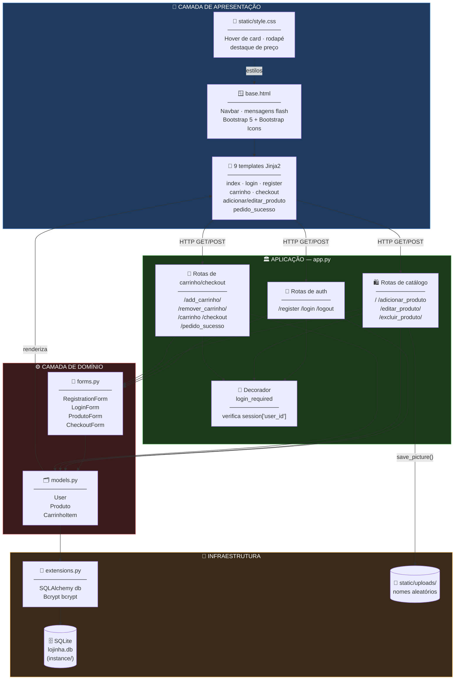
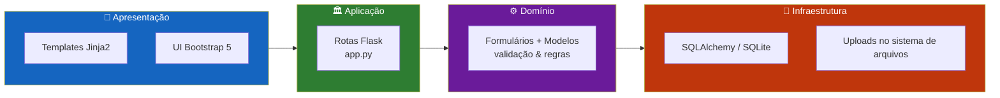
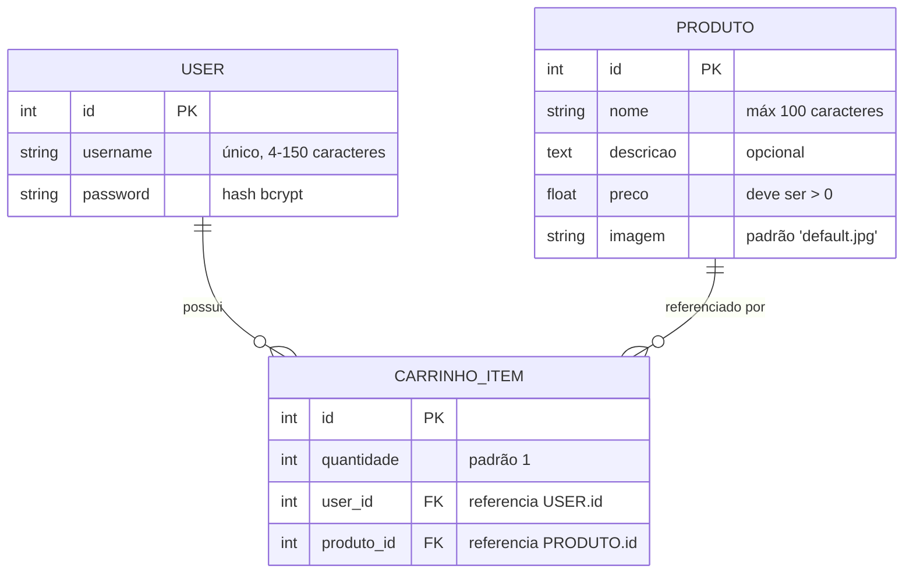
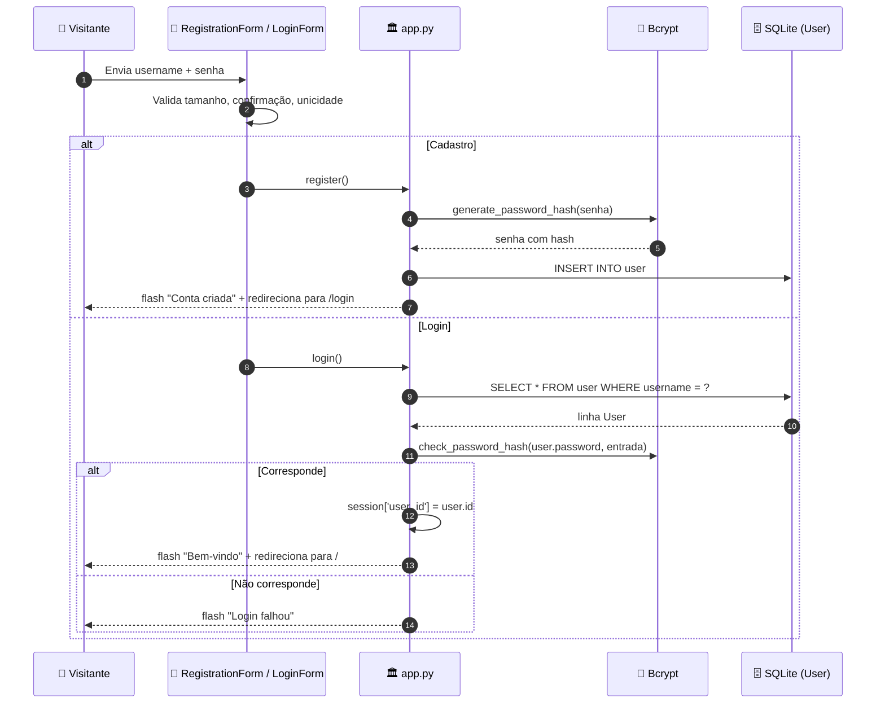
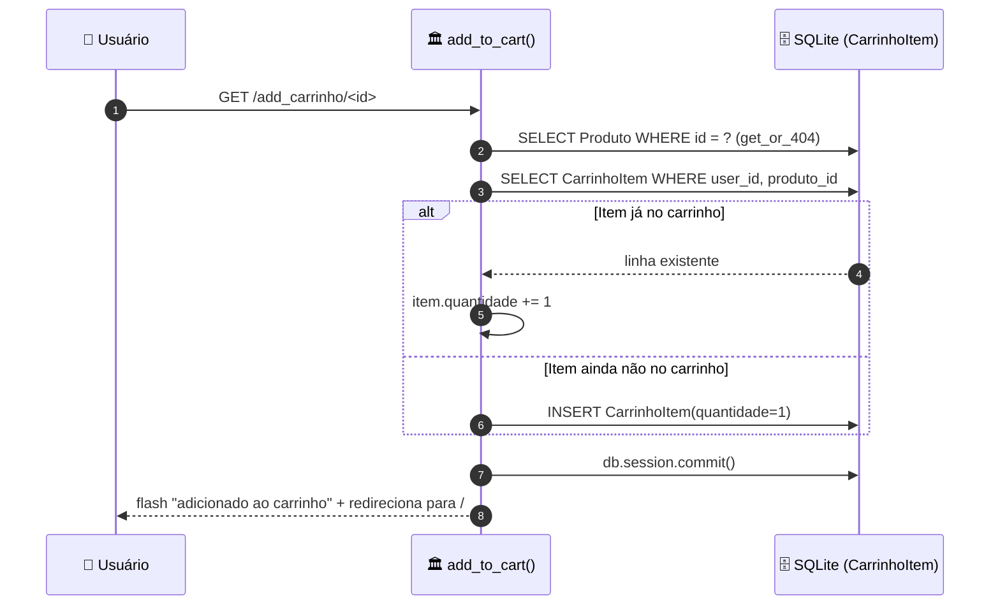
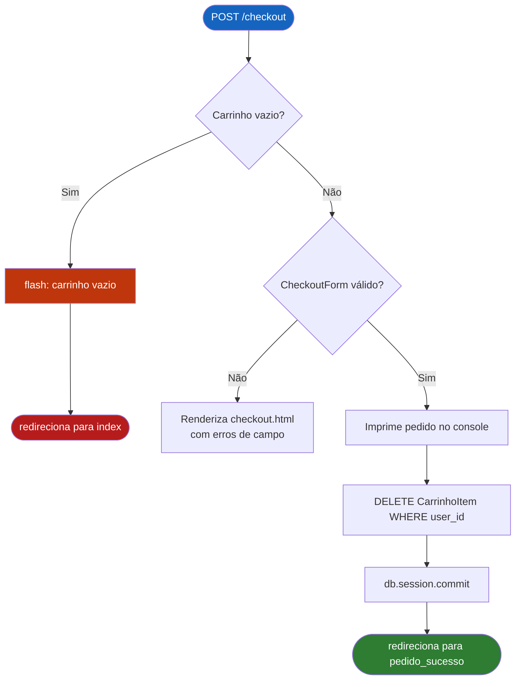
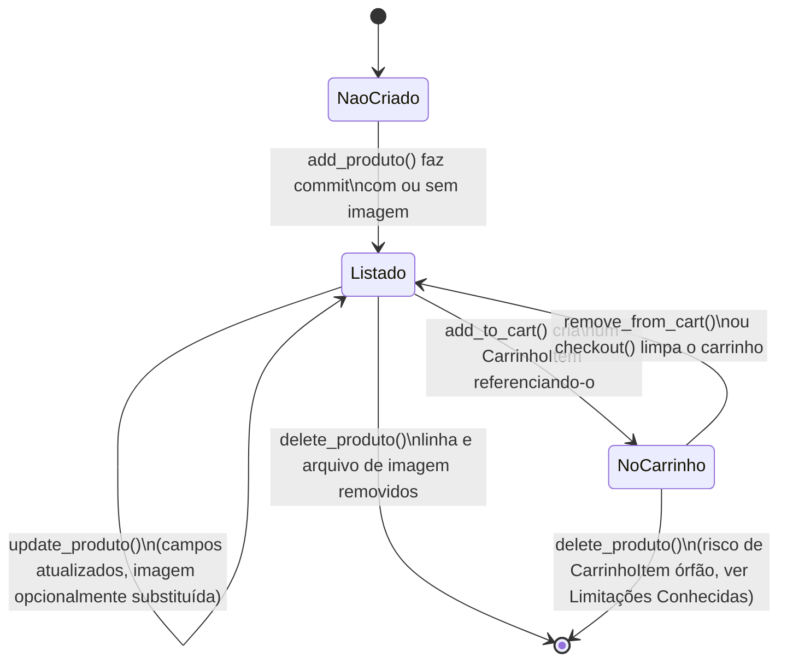
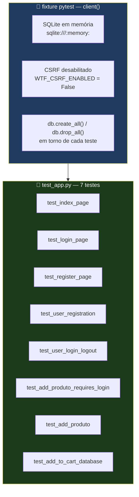

<div align="center">

**🌐 Choose Language / Selecione o Idioma / Elija el Idioma**

[](README.md)&nbsp;&nbsp;&nbsp;[](README_PT.md)&nbsp;&nbsp;&nbsp;[](README_ES.md)

</div>

---

<div align="center">

```
██╗      ██████╗      ██╗██╗███╗   ██╗██╗  ██╗ █████╗
██║     ██╔═══██╗     ██║██║████╗  ██║██║  ██║██╔══██╗
██║     ██║   ██║     ██║██║██╔██╗ ██║███████║███████║
██║     ██║   ██║██   ██║██║██║╚██╗██║██╔══██║██╔══██║
███████╗╚██████╔╝╚█████╔╝██║██║ ╚████║██║  ██║██║  ██║
╚══════╝ ╚═════╝  ╚════╝ ╚═╝╚═╝  ╚═══╝╚═╝  ╚═╝╚═╝  ╚═╝
      Uma pequena loja de bairro construída com Flask
```

---

[](https://www.python.org/)
[](https://flask.palletsprojects.com/)
[](https://flask-sqlalchemy.palletsprojects.com/)
[](https://www.sqlite.org/)
[](https://flask-wtf.readthedocs.io/)
[](https://getbootstrap.com/)
[](https://pytest.org/)

<br/>

> **Lojinha Local é um pequeno sistema de e-commerce full-stack:**
> catálogo, carrinho e checkout para uma loja local, protegido com senhas com hash e login por sessão.

<br/>


</div>

---

## 📑 Índice

<details>
<summary>▶️ <strong>Clique para expandir / recolher esta seção</strong></summary>

<table>
<tr>
<td valign="top" width="50%">

**🏗️ Sistema**
- [Visão Geral](#-visão-geral)
- [Arquitetura do Sistema](#-arquitetura-do-sistema)
- [Stack Tecnológica](#-stack-tecnológica)
- [Padrões de Projeto Aplicados](#-padrões-de-projeto-aplicados)
- [Estrutura do Projeto](#-estrutura-do-projeto)

**📦 Módulos**
- [Bootstrap da Aplicação](#-bootstrap-da-aplicação--apppy)
- [Extensões](#-extensões--extensionspy)
- [Modelos de Dados](#-modelos-de-dados--modelspy)
- [Formulários](#-formulários--formspy)
- [Rotas de Autenticação](#-rotas-de-autenticação)
- [Rotas do Catálogo](#-rotas-do-catálogo)
- [Rotas de Carrinho & Checkout](#-rotas-de-carrinho--checkout)
- [Templates & Recursos Estáticos](#-templates--recursos-estáticos)

</td>
<td valign="top" width="50%">

**💼 Negócio**
- [Regras de Negócio](#-regras-de-negócio)
- [Requisitos Funcionais](#-requisitos-funcionais)
- [Requisitos Não Funcionais](#-requisitos-não-funcionais)

**📐 Design**
- [Modelo de Dados](#-modelo-de-dados)
- [Fluxos do Sistema](#-fluxos-do-sistema)
- [Fluxo de Cadastro & Login](#fluxo-de-cadastro--login)
- [Fluxo de Adicionar ao Carrinho](#fluxo-de-adicionar-ao-carrinho)
- [Fluxo de Checkout](#fluxo-de-checkout)
- [Ciclo de Vida do Produto](#ciclo-de-vida-do-produto-máquina-de-estados)

**🔐 Segurança & Operação**
- [Segurança](#-segurança)
- [Instalação & Execução](#-instalação--execução)
- [Testes Automatizados](#-testes-automatizados)
- [Métricas & Monitoramento](#-métricas--monitoramento)
- [Limitações Conhecidas](#-limitações-conhecidas)

</td>
</tr>
</table>

---

</details>

## 🌟 Visão Geral

<details>
<summary>▶️ <strong>Clique para expandir / recolher esta seção</strong></summary>

**Lojinha Local** é um sistema de e-commerce full-stack escrito em **Python** com **Flask**. Ele implementa o ciclo essencial de uma loja online: um dono autenticado gerencia um catálogo de produtos, visitantes navegam por ele, adicionam itens a um carrinho por usuário persistido no banco de dados, e finalizam um pedido através de um formulário de checkout.

A aplicação é deliberadamente pequena e monolítica: um único `app.py` define todas as rotas, `models.py` define três modelos SQLAlchemy, `forms.py` define quatro formulários `Flask-WTF`, e nove templates Jinja2 estendem um `base.html` compartilhado, estilizado com Bootstrap 5. Não há framework JavaScript, nenhuma API REST e nenhum estado no lado do cliente, cada interação é um envio de formulário de página inteira ou navegação por link tratada no servidor.

A persistência usa **SQLite** através do **Flask-SQLAlchemy**, as senhas são hasheadas com **Flask-Bcrypt**, e a proteção CSRF em todos os formulários é fornecida pelo **Flask-WTF**. As imagens de produto são enviadas para `static/uploads/` com nomes de arquivo aleatórios, para evitar colisões e path traversal a partir de nomes fornecidos pelo usuário.

### 🎯 Objetivos do Sistema

| Objetivo | Descrição |
|-----------|-------------|
| 👤 **Contas de Usuário** | Permitir que visitantes se cadastrem e façam login com senha hasheada antes de gerenciar a loja |
| 🛍️ **Catálogo de Produtos** | Mostrar cada produto na página inicial com imagem, nome, descrição e preço |
| ➕ **Gestão do Catálogo** | Permitir que usuários autenticados criem, editem e excluam produtos, incluindo upload de imagens |
| 🛒 **Carrinho Persistente** | Manter um carrinho de compras por usuário no banco de dados, não na sessão, para que sobreviva a novos logins |
| 💳 **Checkout** | Coletar nome, e-mail e endereço do cliente, esvaziar o carrinho e confirmar o pedido |
| 🖼️ **Manipulação de Imagens** | Armazenar imagens enviadas com nomes de arquivo aleatórios e remover o arquivo antigo quando uma imagem é substituída ou o produto excluído |
| 🔐 **Controle de Acesso** | Proteger toda rota que altera estado (`add`, `edit`, `delete`, carrinho, checkout) com o decorador `login_required` |
| 🧪 **Verificabilidade** | Fornecer uma suíte automatizada `pytest` cobrindo cadastro, login/logout, criação de produto e persistência do carrinho |

---

</details>

## 🏗️ Arquitetura do Sistema

<details>
<summary>▶️ <strong>Clique para expandir / recolher esta seção</strong></summary>

### Diagrama de Módulos



### Camadas da Arquitetura



---

</details>

## 🛠️ Stack Tecnológica

<details>
<summary>▶️ <strong>Clique para expandir / recolher esta seção</strong></summary>

<table>
<thead>
<tr>
<th>Camada</th>
<th>Tecnologia</th>
<th>Versão</th>
<th>Propósito</th>
</tr>
</thead>
<tbody>
<tr>
<td rowspan="2"><strong>🧠 Linguagem</strong></td>
<td>Python</td>
<td>3.x</td>
<td>Linguagem de origem da aplicação</td>
</tr>
<tr>
<td>Jinja2</td>
<td>incluso no Flask</td>
<td>Templating HTML no servidor</td>
</tr>
<tr>
<td rowspan="4"><strong>🌐 Framework Web</strong></td>
<td>Flask</td>
<td>sem versão fixa (<code>requirements.txt</code>)</td>
<td>Aplicação WSGI, roteamento, ciclo requisição/resposta</td>
</tr>
<tr>
<td>Flask-WTF</td>
<td>sem versão fixa</td>
<td>Objetos de formulário, proteção CSRF</td>
</tr>
<tr>
<td>WTForms</td>
<td>incluso no Flask-WTF</td>
<td>Tipos de campo e validadores (<code>DataRequired</code>, <code>Email</code>, <code>EqualTo</code>...)</td>
</tr>
<tr>
<td>email_validator</td>
<td>sem versão fixa</td>
<td>Sustenta o validador <code>Email()</code> usado por <code>CheckoutForm</code></td>
</tr>
<tr>
<td rowspan="2"><strong>💾 Persistência</strong></td>
<td>Flask-SQLAlchemy</td>
<td>sem versão fixa</td>
<td>Camada ORM sobre <code>db.Model</code> (<code>User</code>, <code>Produto</code>, <code>CarrinhoItem</code>)</td>
</tr>
<tr>
<td>SQLite</td>
<td>motor incluso no Python</td>
<td>Banco de dados relacional em arquivo, <code>instance/lojinha.db</code></td>
</tr>
<tr>
<td rowspan="1"><strong>🔐 Segurança</strong></td>
<td>Flask-Bcrypt</td>
<td>sem versão fixa</td>
<td>Hash de senha (<code>generate_password_hash</code> / <code>check_password_hash</code>)</td>
</tr>
<tr>
<td rowspan="3"><strong>🎨 Frontend</strong></td>
<td>Bootstrap</td>
<td>5.3.2 (CDN)</td>
<td>Layout, cards, formulários, navbar, alertas</td>
</tr>
<tr>
<td>Bootstrap Icons</td>
<td>1.11.1 (CDN)</td>
<td>Ícones de carrinho, pessoa e lixeira na navbar e tabela de carrinho</td>
</tr>
<tr>
<td>CSS Customizado</td>
<td><code>static/style.css</code></td>
<td>Animação de hover no card, rodapé fixo, cor do preço</td>
</tr>
<tr>
<td rowspan="1"><strong>🧪 Testes</strong></td>
<td>pytest</td>
<td>sem versão fixa</td>
<td>Testes funcionais sobre o cliente de teste do Flask, <code>test_app.py</code></td>
</tr>
</tbody>
</table>

> [!NOTE]
> `requirements.txt` não fixa números de versão (`Flask`, `Flask-SQLAlchemy`, `Flask-Bcrypt`, `Flask-WTF`, `pytest`, `email_validator`), então as versões efetivamente resolvidas dependem do que o `pip` instalar no momento da configuração. Somente os recursos de frontend carregados via CDN (Bootstrap, Bootstrap Icons) trazem versões explícitas, extraídas diretamente de `templates/base.html`.

---

</details>

## 🎨 Padrões de Projeto Aplicados

<details>
<summary>▶️ <strong>Clique para expandir / recolher esta seção</strong></summary>

| Padrão | Onde | Justificativa |
|---------|-------|-----------|
| 🧭 **Application Factory (parcial)** | `app = Flask(__name__)` + `db.init_app(app)` / `bcrypt.init_app(app)` em `app.py` | As extensões são instanciadas em `extensions.py` e vinculadas depois, evitando importações circulares entre `models.py` e `app.py` |
| 🚦 **Decorator / Guard Clause** | `login_required` em `app.py` | Centraliza a verificação "precisa estar autenticado" em vez de repeti-la em cada view |
| 🗂️ **Active Record (via ORM)** | `User`, `Produto`, `CarrinhoItem` em `models.py` | Cada modelo envolve sua própria tabela e relacionamentos, seguindo o modo como `Flask-SQLAlchemy` expõe `db.Model` |
| 📝 **Form Object** | `RegistrationForm`, `LoginForm`, `ProdutoForm`, `CheckoutForm` em `forms.py` | Regras de validação e definições de campo são declaradas uma vez e reutilizadas entre `GET`/`POST` |
| 🧩 **Herança de Template** | `` em todo template de página | Navbar, mensagens flash e rodapé são definidos uma única vez em `base.html` |
| 🔁 **Extração de Helper** | `save_picture()`, `get_cart_details()` em `app.py` | Lógica repetida (persistência de arquivo, agregação de carrinho) é extraída dos handlers de rota |
| 🏷️ **Validador Customizado** | `RegistrationForm.validate_username` | A convenção do WTForms de métodos `validate_<campo>` garante a unicidade do nome de usuário no banco |
| 🔀 **Strategy (implícito)** | `ver_carrinho()` vs `get_cart_details()` | Duas estratégias similares de agregação de carrinho existem para exibição (dict com dados completos) versus checkout (apenas nome + quantidade) |

---

</details>

## 📁 Estrutura do Projeto

<details>
<summary>▶️ <strong>Clique para expandir / recolher esta seção</strong></summary>

```
lojinha_local/
│
├── 📄 app.py                       # App Flask, todas as 15 rotas, save_picture(), login_required
├── 📄 extensions.py                # Instâncias compartilhadas de SQLAlchemy `db` e Bcrypt `bcrypt`
├── 📄 models.py                    # Modelos SQLAlchemy User, Produto, CarrinhoItem
├── 📄 forms.py                     # RegistrationForm, LoginForm, ProdutoForm, CheckoutForm
├── 📄 test_app.py                  # Suíte pytest (7 testes) sobre o cliente de teste do Flask
├── 📄 requirements.txt             # Flask, Flask-SQLAlchemy, Flask-Bcrypt, Flask-WTF, pytest, email_validator
├── 📄 .gitignore                   # Exclui segredos, *.db, caches, venvs
├── 📄 produtos.db                  # Arquivo SQLite legado/solto na raiz (não usado por app.py)
│
├── 📂 instance/
│   └── 📄 lojinha.db               # Banco de dados SQLite ativo (SQLALCHEMY_DATABASE_URI)
│
├── 📂 images/                      # Fotos de produto de referência/seed (não servidas pelo Flask)
│   ├── download.jpg
│   ├── images.jpg
│   ├── vitaminico.jpg
│   └── whey_1kg.jpg
│
├── 📂 static/
│   ├── 📄 style.css                # Hover de card, rodapé fixo, cor de preço (servido em /static/style.css)
│   └── 📂 uploads/                 # Imagens de produto enviadas, nomes com 16 caracteres hex aleatórios
│       ├── 00c736fb18612e1c.jpg
│       ├── 3d1cc0a715767b0e.jpg
│       ├── a8d1f22085501241.jpg
│       ├── bb87983865f6ae47.jpg
│       └── d89f03ba49bf53f4.jpg
│
├── 📂 templates/
│   ├── 📄 base.html                # Layout compartilhado: navbar, mensagens flash, rodapé
│   ├── 📄 index.html               # Grade do catálogo de produtos
│   ├── 📄 login.html               # Formulário de login
│   ├── 📄 register.html            # Formulário de cadastro
│   ├── 📄 adicionar_produto.html   # Formulário de adicionar produto (multipart, upload de imagem)
│   ├── 📄 editar_produto.html      # Formulário de editar produto, pré-preenchido via `obj=produto`
│   ├── 📄 carrinho.html            # Tabela do carrinho com subtotal/total e links de remoção
│   ├── 📄 checkout.html            # Resumo do pedido + CheckoutForm
│   └── 📄 pedido_sucesso.html      # Página de confirmação do pedido
│
├── 📄 README.md                    # 🇺🇸 English (primário)
├── 📄 README_PT.md                 # 🇧🇷 Português
└── 📄 README_ES.md                 # 🇪🇸 Español
```

---

</details>

## 📦 Módulos do Sistema

<details>
<summary>▶️ <strong>Clique para expandir / recolher esta seção</strong></summary>

### 🏛️ Bootstrap da Aplicação — `app.py`

O ponto de entrada. Cria a aplicação `Flask`, configura `SECRET_KEY`, `instance_path`, `SQLALCHEMY_DATABASE_URI`, `UPLOAD_FOLDER` e `MAX_CONTENT_LENGTH`, e então vincula as duas extensões compartilhadas e registra as 15 rotas.

| Responsabilidade | Implementação |
|-----------------|----------------|
| Configuração | `app.config['SQLALCHEMY_DATABASE_URI'] = 'sqlite:///lojinha.db'` (resolvido dentro de `instance/`) |
| Diretório de upload | `app.config['UPLOAD_FOLDER'] = os.path.join(app.root_path, 'static', 'uploads')`, criado com `os.makedirs(..., exist_ok=True)` |
| Limite de tamanho de upload | `app.config['MAX_CONTENT_LENGTH'] = 16 * 1024 * 1024` (16 MB) |
| Vinculação de extensões | `db.init_app(app)`, `bcrypt.init_app(app)` |
| Ponto de entrada dev | `if __name__ == '__main__': db.create_all(); app.run(debug=True)` |

---

### 🔌 Extensões — `extensions.py`

Um módulo de duas linhas que existe puramente para quebrar a importação circular entre `app.py` (que precisa de `db` para configurar a aplicação) e `models.py` (que precisa de `db.Model` para declarar tabelas).

| Objeto | Tipo | Propósito |
|--------|------|---------|
| `db` | `flask_sqlalchemy.SQLAlchemy()` | Instância ORM compartilhada, vinculada em `app.py`, importada por `models.py` |
| `bcrypt` | `flask_bcrypt.Bcrypt()` | Instância de hash compartilhada, vinculada em `app.py`, usada em `register()` e `login()` |

---

### 🗂️ Modelos de Dados — `models.py`

Três classes `db.Model` sem `__init__` ou `__repr__` customizados, contando inteiramente com os padrões do `Flask-SQLAlchemy`.

| Modelo | Colunas | Relacionamentos |
|-------|---------|---------------|
| `User` | `id`, `username` (único), `password` (hash bcrypt) | `carrinho_itens` — um-para-muitos com `CarrinhoItem`, `cascade="all, delete-orphan"` |
| `Produto` | `id`, `nome`, `descricao` (opcional), `preco` (`Float`), `imagem` (padrão `'default.jpg'`) | referenciado por `CarrinhoItem.produto_id` |
| `CarrinhoItem` | `id`, `quantidade` (padrão `1`), `user_id` (FK), `produto_id` (FK) | `produto` — `db.relationship('Produto')`; `user` backref criado a partir de `User.carrinho_itens` |

---

### 📝 Formulários — `forms.py`

Quatro subclasses de `FlaskForm`, cada uma associada a uma rota específica.

| Formulário | Campos | Principais validadores |
|------|--------|-----------------|
| `RegistrationForm` | `username`, `password`, `confirm_password`, `submit` | `Length(min=4, max=150)` no username, `Length(min=6)` na senha, `EqualTo('password')` na confirmação, verificação de unicidade customizada `validate_username` |
| `LoginForm` | `username`, `password`, `submit` | `DataRequired()` em ambos os campos |
| `ProdutoForm` | `nome`, `descricao`, `preco`, `imagem`, `submit_add`, `submit_update` | `Length(max=100)` no nome, `NumberRange(min=0.01)` no preço, `FileAllowed(['jpg','png','jpeg'])` na imagem |
| `CheckoutForm` | `nomeCompleto`, `email`, `endereco`, `submit` | `Email()` no e-mail, `Length(min=10)` no endereço |

---

### 🔐 Rotas de Autenticação

| Rota | Métodos | Handler | Comportamento |
|-------|---------|---------|----------|
| `/register` | `GET`, `POST` | `register()` | Hasheia a senha com `bcrypt.generate_password_hash`, cria um `User`, redireciona para `/login` |
| `/login` | `GET`, `POST` | `login()` | Busca `User` pelo username, verifica com `bcrypt.check_password_hash`, armazena `user_id`/`username` na `session` |
| `/logout` | `GET` | `logout()` | `login_required`; remove `user_id`/`username` da `session` |

---

### 🛍️ Rotas do Catálogo

| Rota | Métodos | Handler | Comportamento |
|-------|---------|---------|----------|
| `/` | `GET` | `index()` | Lista todos os `Produto` na página inicial |
| `/adicionar_produto` | `GET`, `POST` | `add_produto()` | `login_required`; salva a imagem enviada via `save_picture()`, cria um `Produto` |
| `/editar_produto/<int:id>` | `GET`, `POST` | `update_produto()` | `login_required`; `Produto.query.get_or_404(id)`, substitui o arquivo de imagem e apaga o antigo se um novo for enviado |
| `/excluir_produto/<int:id>` | `GET` | `delete_produto()` | `login_required`; apaga o arquivo de imagem do disco (a menos que seja `'default.jpg'`) e a linha `Produto` |

---

### 🛒 Rotas de Carrinho & Checkout

| Rota | Métodos | Handler | Comportamento |
|-------|---------|---------|----------|
| `/add_carrinho/<int:id>` | `GET` | `add_to_cart()` | `login_required`; incrementa `quantidade` se já existir um `CarrinhoItem` para esse usuário/produto, senão cria um |
| `/remover_carrinho/<int:id>` | `GET` | `remove_from_cart()` | `login_required`; apaga a linha `CarrinhoItem` correspondente |
| `/carrinho` | `GET` | `ver_carrinho()` | `login_required`; monta um dict de exibição com nome, preço, quantidade e subtotal por item, mais o total geral |
| `/checkout` | `GET`, `POST` | `checkout()` | `login_required`; redireciona para `/` se o carrinho estiver vazio; ao submeter `CheckoutForm` válido, limpa as linhas `CarrinhoItem` do usuário e redireciona para `/pedido_sucesso` |
| `/pedido_sucesso` | `GET` | `pedido_sucesso()` | `login_required`; renderiza a página estática de confirmação |

---

### 🖼️ Templates & Recursos Estáticos

| Recurso | Papel |
|-------|------|
| `templates/base.html` | Navbar Bootstrap com links condicionais de login/carrinho/logout, renderização de mensagens flash, rodapé |
| `templates/index.html` | Grade de cards iterando `produtos`, com ações de adicionar ao carrinho / editar / excluir por card |
| `templates/carrinho.html` | Tabela dos itens de `display_cart` com ação de remoção e total calculado |
| `templates/checkout.html` | Layout de duas colunas: resumo do pedido a partir de `display_order` mais o `CheckoutForm` |
| `static/style.css` | Transformação de hover no card, preço verde em negrito, rodapé fixo |

---

</details>

## 💼 Regras de Negócio

<details>
<summary>▶️ <strong>Clique para expandir / recolher esta seção</strong></summary>

### 👤 Regras de Conta

| # | Regra | Aplicação |
|---|------|-------------|
| RN-01 | Nomes de usuário devem ser únicos | `RegistrationForm.validate_username` consulta `User` antes de permitir o envio |
| RN-02 | Nomes de usuário devem ter de 4 a 150 caracteres | `Length(min=4, max=150)` em `RegistrationForm.username` |
| RN-03 | Senhas devem ter no mínimo 6 caracteres | `Length(min=6)` em `RegistrationForm.password` |
| RN-04 | A confirmação de senha deve ser igual à senha | `EqualTo('password')` em `confirm_password` |
| RN-05 | Senhas nunca são armazenadas em texto plano | `bcrypt.generate_password_hash` antes de `db.session.add(user)` |

### 🛍️ Regras do Catálogo

| # | Regra | Aplicação |
|---|------|-------------|
| RN-06 | O preço de um produto deve ser estritamente positivo | `NumberRange(min=0.01)` em `ProdutoForm.preco` |
| RN-07 | Imagens enviadas devem ser JPG, PNG ou JPEG | `FileAllowed(['jpg', 'png', 'jpeg'])` em `ProdutoForm.imagem` |
| RN-08 | Substituir a imagem de um produto apaga o arquivo anterior, exceto se for a padrão | `if produto.imagem and produto.imagem != 'default.jpg': os.remove(...)` em `update_produto()` |
| RN-09 | Excluir um produto apaga seu arquivo de imagem, exceto se for a padrão | Mesma verificação em `delete_produto()` |
| RN-10 | Nomes de arquivo enviados são randomizados para evitar colisões | `save_picture()` usa `secrets.token_hex(8)` mais a extensão original |

### 🛒 Regras de Carrinho & Checkout

| # | Regra | Aplicação |
|---|------|-------------|
| RN-11 | Adicionar um produto já no carrinho incrementa a quantidade em vez de duplicar a linha | `add_to_cart()` verifica `CarrinhoItem.query.filter_by(user_id=..., produto_id=...).first()` |
| RN-12 | O carrinho é restrito ao usuário autenticado | Toda consulta de carrinho filtra por `session['user_id']` |
| RN-13 | O checkout é bloqueado quando o carrinho está vazio | `if not display_order: flash(...); return redirect(url_for('index'))` |
| RN-14 | Um checkout bem-sucedido esvazia o carrinho | `CarrinhoItem.query.filter_by(user_id=user_id).delete()` dentro de `checkout()` |
| RN-15 | Excluir um `User` cascateia para excluir os itens do seu carrinho | `cascade="all, delete-orphan"` em `User.carrinho_itens` |

### 🔐 Regras de Acesso

| # | Regra | Aplicação |
|---|------|-------------|
| RN-16 | Toda rota que altera dados ou expõe dados pessoais exige sessão ativa | `@login_required` em `add_produto`, `update_produto`, `delete_produto`, `add_to_cart`, `remove_from_cart`, `ver_carrinho`, `checkout`, `pedido_sucesso`, `logout` |
| RN-17 | Um visitante não autenticado é redirecionado para `/login` com mensagem flash | Corpo do decorador `login_required` |

---

</details>

## ✅ Requisitos Funcionais

<details>
<summary>▶️ <strong>Clique para expandir / recolher esta seção</strong></summary>

| ID | Requisito | Prioridade | Status |
|----|-------------|----------|--------|
| **RF-01** | O sistema deve permitir que um visitante se cadastre com nome de usuário e senha únicos | 🔴 Alta | ✅ Implementado |
| **RF-02** | O sistema deve rejeitar o cadastro se o nome de usuário já existir | 🔴 Alta | ✅ Implementado |
| **RF-03** | O sistema deve permitir que um usuário cadastrado faça login com nome de usuário e senha | 🔴 Alta | ✅ Implementado |
| **RF-04** | O sistema deve permitir que um usuário autenticado faça logout | 🟡 Média | ✅ Implementado |
| **RF-05** | O sistema deve listar todos os produtos na página inicial | 🔴 Alta | ✅ Implementado |
| **RF-06** | O sistema deve permitir que um usuário autenticado adicione um novo produto com nome, descrição, preço e imagem opcional | 🔴 Alta | ✅ Implementado |
| **RF-07** | O sistema deve permitir que um usuário autenticado edite um produto existente | 🔴 Alta | ✅ Implementado |
| **RF-08** | O sistema deve permitir que um usuário autenticado exclua um produto | 🟡 Média | ✅ Implementado |
| **RF-09** | O sistema deve apagar o arquivo de imagem associado quando um produto é excluído ou sua imagem substituída | 🟡 Média | ✅ Implementado |
| **RF-10** | O sistema deve permitir que um usuário autenticado adicione um produto ao carrinho | 🔴 Alta | ✅ Implementado |
| **RF-11** | O sistema deve incrementar a quantidade quando o mesmo produto é adicionado novamente | 🟡 Média | ✅ Implementado |
| **RF-12** | O sistema deve permitir que um usuário remova um item do carrinho | 🟡 Média | ✅ Implementado |
| **RF-13** | O sistema deve exibir o carrinho com preço unitário, quantidade, subtotal e total geral | 🔴 Alta | ✅ Implementado |
| **RF-14** | O sistema deve bloquear o checkout quando o carrinho está vazio | 🟡 Média | ✅ Implementado |
| **RF-15** | O sistema deve coletar nome completo, e-mail e endereço no checkout | 🔴 Alta | ✅ Implementado |
| **RF-16** | O sistema deve validar o formato do e-mail no checkout | 🟡 Média | ✅ Implementado |
| **RF-17** | O sistema deve esvaziar o carrinho após um checkout bem-sucedido | 🔴 Alta | ✅ Implementado |
| **RF-18** | O sistema deve exibir uma página de confirmação de pedido após o checkout | 🟢 Baixa | ✅ Implementado |
| **RF-19** | O sistema deve exibir feedback flash para toda ação de criar/editar/excluir/login/logout | 🟢 Baixa | ✅ Implementado |
| **RF-20** | O sistema deve proteger toda rota que altera estado por trás de autenticação | 🔴 Alta | ✅ Implementado |
| **RF-21** | O sistema deve persistir o envio do checkout (nome, e-mail) além de um log no console | 🟡 Média | ⬜ Planejado |
| **RF-22** | O sistema deve permitir que um usuário altere a quantidade de um item do carrinho diretamente | 🟢 Baixa | ⬜ Planejado |

---

</details>

## ⚡ Requisitos Não Funcionais

<details>
<summary>▶️ <strong>Clique para expandir / recolher esta seção</strong></summary>

| ID | Categoria | Requisito | Alvo |
|----|----------|-------------|--------|
| **RNF-01** | 🔐 Segurança | Senhas nunca devem ser armazenadas ou logadas em texto plano | 100% das senhas armazenadas são hashes bcrypt |
| **RNF-02** | 🔐 Segurança | Todo envio de formulário deve conter um token CSRF | Garantido via `hidden_tag()` do `Flask-WTF` nos 4 formulários |
| **RNF-03** | 📦 Segurança de Upload | Arquivos enviados devem ter um limite de tamanho | `MAX_CONTENT_LENGTH = 16 * 1024 * 1024` (16 MB) |
| **RNF-04** | 📦 Segurança de Upload | Imagens de produto enviadas devem ser restritas a tipos seguros | `FileAllowed(['jpg', 'png', 'jpeg'])` |
| **RNF-05** | 🗂️ Integridade de Dados | Toda linha de carrinho deve referenciar um usuário e produto válidos | `ForeignKey('user.id')`, `ForeignKey('produto.id')` com `nullable=False` |
| **RNF-06** | ⚡ Desempenho | A agregação do carrinho deve evitar consultas N+1 | `options(db.joinedload(CarrinhoItem.produto))` em `ver_carrinho()` e `get_cart_details()` |
| **RNF-07** | 🎨 Usabilidade | A interface deve renderizar corretamente em mobile e desktop | Classes de grade responsiva do Bootstrap 5 (`col-md-4`, `row g-5`, etc.) |
| **RNF-08** | 🎨 Usabilidade | Toda ação destrutiva deve pedir confirmação | `onclick="return confirm(...)"` no link de excluir produto |
| **RNF-09** | 🌍 Internacionalização | Os textos e mensagens flash estão em um único idioma | Todas as strings atualmente fixas em português do Brasil |
| **RNF-10** | 🧱 Manutenibilidade | O chrome de UI compartilhado deve ficar em um único lugar | Herança de `base.html` nos 8 templates de página |
| **RNF-11** | 🧱 Manutenibilidade | As instâncias ORM devem ser definidas uma vez para evitar importações circulares | Centralizado em `extensions.py` |
| **RNF-12** | 🧪 Testabilidade | Os fluxos principais devem ser cobertos por uma suíte de testes automatizada | `test_app.py`, 7 testes sobre o cliente de teste do Flask |
| **RNF-13** | 🔧 Configurabilidade | O local do banco de dados e a pasta de upload devem ser resolvíveis relativamente à app | `app.instance_path`, `app.root_path` usados em vez de caminhos absolutos fixos |
| **RNF-14** | 💾 Portabilidade | O motor de banco de dados não deve exigir um servidor externo | Arquivo SQLite em `instance/lojinha.db` |
| **RNF-15** | ♿ Acessibilidade | Os campos de formulário devem conter elementos `<label>` associados | `form.<campo>.label(...)` renderizado antes de cada input em todos os templates de formulário |

---

</details>

## 🗄️ Modelo de Dados

<details>
<summary>▶️ <strong>Clique para expandir / recolher esta seção</strong></summary>

### Diagrama Entidade-Relacionamento



### Detalhe do Esquema

| Tabela | Coluna | Tipo | Restrições |
|-------|--------|------|-------------|
| `user` | `id` | `Integer` | Chave primária |
| `user` | `username` | `String(150)` | Único, não nulo |
| `user` | `password` | `String(150)` | Não nulo, hash bcrypt |
| `produto` | `id` | `Integer` | Chave primária |
| `produto` | `nome` | `String(100)` | Não nulo |
| `produto` | `descricao` | `Text` | Opcional |
| `produto` | `preco` | `Float` | Não nulo |
| `produto` | `imagem` | `String(300)` | Opcional, padrão `'default.jpg'` |
| `carrinho_item` | `id` | `Integer` | Chave primária |
| `carrinho_item` | `quantidade` | `Integer` | Não nulo, padrão `1` |
| `carrinho_item` | `user_id` | `Integer` | Chave estrangeira → `user.id`, não nulo |
| `carrinho_item` | `produto_id` | `Integer` | Chave estrangeira → `produto.id`, não nulo |

### Locais de Armazenamento

| Aspecto | Local | Notas |
|---------|----------|-------|
| Dados relacionais | `instance/lojinha.db` | Criado por `db.create_all()` na primeira execução, dentro do contexto da aplicação Flask |
| Imagens enviadas | `static/uploads/<16-hex>.<ext>` | Nome de arquivo gerado por `secrets.token_hex(8)` em `save_picture()` |
| Arquivo de banco solto | `produtos.db` (raiz do repositório) | Presente no repositório, mas não referenciado por `SQLALCHEMY_DATABASE_URI`, parece ser um resquício de uma configuração anterior |

---

</details>

## 🔄 Fluxos do Sistema

<details>
<summary>▶️ <strong>Clique para expandir / recolher esta seção</strong></summary>

### Fluxo de Cadastro & Login



### Fluxo de Adicionar ao Carrinho



### Fluxo de Checkout



### Ciclo de Vida do Produto (Máquina de Estados)



---

</details>

## 🔐 Segurança

<details>
<summary>▶️ <strong>Clique para expandir / recolher esta seção</strong></summary>

### Controles Implementados

| Controle | Implementação | Efeito |
|---------|---------------|--------|
| 🔐 **Hash de senha** | `flask_bcrypt.Bcrypt` em `extensions.py`, usado por `register()`/`login()` | Senhas em texto plano nunca são persistidas |
| 🛡️ **Proteção CSRF** | `hidden_tag()` do `Flask-WTF` renderizado em todo template de formulário | Falsificação de requisição entre sites é rejeitada sem um token válido |
| 🚦 **Autorização por rota** | Decorador `login_required` em 9 rotas | Requisições não autenticadas a rotas protegidas são redirecionadas, não executadas |
| 🧾 **Validação no servidor** | Validadores WTForms (`DataRequired`, `Length`, `Email`, `EqualTo`, `NumberRange`, `FileAllowed`) | Entradas malformadas são rejeitadas antes de chegar ao banco de dados |
| 📦 **Limite de tamanho de upload** | `MAX_CONTENT_LENGTH = 16 * 1024 * 1024` | Uploads muito grandes são rejeitados pelo Flask antes de chegar à view |
| 🖼️ **Randomização de nome de arquivo** | `save_picture()` usa `secrets.token_hex(8)` | Nomes de arquivo fornecidos pelo usuário nunca chegam diretamente ao sistema de arquivos, mitigando path traversal |
| 🗂️ **Consultas restritas** | Toda consulta de carrinho filtra por `session['user_id']` | Um usuário não consegue ler ou modificar o carrinho de outro usuário através das rotas expostas |

### Limitações de Segurança Conhecidas

> [!WARNING]
> As limitações a seguir são inerentes ao design atual e devem ser entendidas antes de qualquer uso em produção.

| Limitação | Risco | Caminho de mitigação |
|------------|------|-----------------|
| 🔑 **`SECRET_KEY` fixa no código** | `app.config['SECRET_KEY'] = 'sua_chave_secreta_muito_segura'` está commitada em `app.py` | Carregar a chave de uma variável de ambiente, nunca commitá-la |
| 🐛 **`debug=True` no ponto de entrada** | `app.run(debug=True)` expõe o debugger interativo do Werkzeug se acessível fora do localhost | Desabilitar o modo debug fora do desenvolvimento local, usar uma flag de ambiente |
| 🧍 **Sem verificação de propriedade nos produtos** | Qualquer usuário autenticado pode editar ou excluir qualquer produto, não apenas os seus | Adicionar um `owner_id` em `Produto` e verificá-lo em `update_produto`/`delete_produto` |
| 🗂️ **Sem limitação de taxa em login/cadastro** | Tentativas de força bruta contra credenciais não são limitadas | Adicionar `Flask-Limiter` ou um limite de taxa no proxy reverso |
| 📝 **Dados do pedido apenas impressos no console** | `checkout()` usa `print(...)`, então nome/e-mail enviados não são armazenados de forma durável ou auditável | Persistir pedidos em um modelo `Pedido` dedicado |
| 🖼️ **Extensão do arquivo confiada ao indicativo MIME do cliente** | `FileAllowed` verifica a extensão, não os bytes reais do conteúdo do arquivo | Validar magic bytes / reconverter a imagem no servidor |
| 🍪 **Cookie de sessão com padrões do Flask** | Nenhuma configuração explícita de `SESSION_COOKIE_SECURE` / `SESSION_COOKIE_HTTPONLY` em `app.py` | Definir essas flags explicitamente, especialmente antes de implantar sobre HTTPS |

---

</details>

## 🚀 Instalação & Execução

<details>
<summary>▶️ <strong>Clique para expandir / recolher esta seção</strong></summary>

### Pré-requisitos

```bash
# Python 3.x com pip
python --version
pip --version
```

### Build

```bash
# Clone ou entre no diretório do projeto
cd lojinha_local

# (Recomendado) crie e ative um ambiente virtual
python -m venv venv
# Windows:
venv\Scripts\activate
# macOS/Linux:
source venv/bin/activate

# Instale as dependências
pip install -r requirements.txt
```

### Execução

```bash
# Execute o servidor de desenvolvimento (cria instance/lojinha.db na primeira execução)
python app.py
# O Flask inicia em modo debug em http://127.0.0.1:5000/
```

**Uso na aplicação**

1. Abra `http://127.0.0.1:5000/` — o catálogo carrega vazio na primeira execução.
2. Clique em **Cadastro** e crie uma conta (username com 4+ caracteres, senha com 6+ caracteres).
3. Faça login e clique em **Adicionar Produto** para criar o primeiro produto (nome, preço, imagem opcional).
4. Na página inicial, use **Adicionar ao Carrinho** em qualquer card de produto.
5. Abra **Carrinho** para revisar quantidades e o total, depois **Finalizar Compra**.
6. Preencha nome, e-mail e endereço, envie, e chegue à página de confirmação do pedido.

### Scripts & Alvos

| Comando | Propósito |
|---------|---------|
| `python app.py` | Executa o servidor de desenvolvimento, com `db.create_all()` executado na inicialização |
| `pip install -r requirements.txt` | Instala Flask, Flask-SQLAlchemy, Flask-Bcrypt, Flask-WTF, pytest, email_validator |
| `pytest` | Executa a suíte de testes automatizada (`test_app.py`) |
| `pytest -v` | Executa os testes com saída detalhada por teste |

### Referência de Configuração

| Configuração | Valor | Declarado em |
|---------|-------|-------------|
| `SECRET_KEY` | string fixa no código | `app.py` |
| `SQLALCHEMY_DATABASE_URI` | `sqlite:///lojinha.db` | `app.py` (resolvido contra `instance_path`) |
| `UPLOAD_FOLDER` | `static/uploads/` | `app.py` |
| `MAX_CONTENT_LENGTH` | `16 * 1024 * 1024` (16 MB) | `app.py` |
| `debug` | `True` | `app.run(debug=True)` em `app.py` |

---

</details>

## 🧪 Testes Automatizados

<details>
<summary>▶️ <strong>Clique para expandir / recolher esta seção</strong></summary>

### Arquitetura de Testes



| Teste | Verifica |
|------|----------|
| `test_index_page` | `/` retorna 200 e renderiza "Nossos Produtos" |
| `test_login_page` | `/login` retorna 200 e renderiza "Login" |
| `test_register_page` | `/register` retorna 200 e renderiza "Cadastro" |
| `test_user_registration` | O cadastro é bem-sucedido e a linha `User` existe depois |
| `test_user_login_logout` | O login define `session['user_id']`, o logout o limpa |
| `test_add_produto_requires_login` | `GET /adicionar_produto` sem autenticação redireciona para a flash de login |
| `test_add_produto` | Criação de produto autenticada persiste um `Produto` com o preço correto |
| `test_add_to_cart_database` | `add_to_cart` persiste um `CarrinhoItem` com `quantidade == 1` |

### Executando os Testes

```bash
# Executa a suíte completa
pytest

# Executa com saída detalhada
pytest -v

# Executa um único teste
pytest test_app.py::test_user_login_logout
```

### Checklist de Aceitação Manual

| # | Cenário | Resultado esperado |
|---|----------|------------------|
| 1 | Cadastrar com nome de usuário com menos de 4 caracteres | Formulário re-renderiza com erro de validação de tamanho |
| 2 | Cadastrar com nome de usuário duplicado | Formulário re-renderiza com "Esse nome de usuário já existe" |
| 3 | Fazer login com senha errada | Flash "Login falhou" é exibida |
| 4 | Adicionar um produto sem imagem | Produto é listado usando `default.jpg` |
| 5 | Editar um produto e enviar uma nova imagem | Arquivo de imagem antigo é removido de `static/uploads/` |
| 6 | Adicionar o mesmo produto ao carrinho duas vezes | Quantidade vira 2, sem linha duplicada |
| 7 | Visitar `/checkout` com o carrinho vazio | Redirecionado para `/` com flash de aviso |
| 8 | Completar o checkout | Carrinho é esvaziado e a página de confirmação é exibida |
| 9 | Visitar qualquer rota protegida deslogado | Redirecionado para `/login` com flash de aviso |

---

</details>

## 📊 Métricas & Monitoramento

<details>
<summary>▶️ <strong>Clique para expandir / recolher esta seção</strong></summary>

### Métricas do Código

| Métrica | Valor |
|--------|-------|
| Arquivos-fonte Python | 4 (`app.py`, `extensions.py`, `models.py`, `forms.py`) + `test_app.py` |
| Rotas Flask | 15 |
| Modelos SQLAlchemy | 3 (`User`, `Produto`, `CarrinhoItem`) |
| Classes de formulário WTForms | 4 |
| Templates Jinja2 | 9 |
| Testes pytest | 8 (7 funções `test_*` nomeadas mais 1 helper) |
| Imagens de exemplo enviadas presentes | 5 arquivos em `static/uploads/` |
| Imagens de referência (não usadas pela app) | 4 arquivos em `images/` |

### Sinais em Tempo de Execução

| Sinal | Origem | Onde observar |
|--------|--------|-------------------|
| Mensagens flash | Chamadas `flash(message, category)` em `app.py` | Renderizadas dentro do bloco `get_flashed_messages` de `base.html` |
| Estado de sessão | `session['user_id']`, `session['username']` | Cookie de sessão do lado do servidor |
| Atividade SQL | Chamadas ORM do SQLAlchemy | Habilite `app.config['SQLALCHEMY_ECHO'] = True` para logar SQL no stdout |
| Ciclo requisição/resposta | Log do servidor de desenvolvimento embutido do Flask | Saída do console ao executar `python app.py` |

### Comandos Úteis

```bash
# Inspeciona o esquema do SQLite diretamente
sqlite3 instance/lojinha.db ".schema"

# Conta linhas por tabela
sqlite3 instance/lojinha.db "SELECT COUNT(*) FROM user;"
sqlite3 instance/lojinha.db "SELECT COUNT(*) FROM produto;"
sqlite3 instance/lojinha.db "SELECT COUNT(*) FROM carrinho_item;"

# Lista as imagens de produto enviadas
ls static/uploads/

# Executa a suíte de testes com saída detalhada
pytest -v
```

### Códigos de Status Padronizados

| Código | Significado | Onde aparece |
|------|---------|-------------------|
| `200` | Renderização de página bem-sucedida | Toda rota `GET` em caso de sucesso |
| `302` | Redirecionamento | Após todo `POST` bem-sucedido (`register`, `login`, `add_produto`, `checkout`, ...) |
| `404` | Não encontrado | `get_or_404()` em `update_produto` e `delete_produto` |
| `413` | Payload muito grande | Upload excedendo `MAX_CONTENT_LENGTH` (16 MB) |

---

</details>

## ⚠️ Limitações Conhecidas

<details>
<summary>▶️ <strong>Clique para expandir / recolher esta seção</strong></summary>

> [!IMPORTANT]
> Este projeto é uma aplicação de aprendizado/demonstração. Vários atalhos aqui documentados são adequados para uma demonstração local, mas precisariam ser tratados antes de qualquer implantação real.

| Categoria | Problema | Status |
|----------|-------|--------|
| 🎨 **Link de stylesheet quebrado** | `base.html` requisita `static/css/style.css`, mas o arquivo está de fato em `static/style.css` | ⚠️ Aberto |
| 🔑 **Chave secreta fixa no código** | `SECRET_KEY` é uma string literal commitada em `app.py` | ⚠️ Aberto |
| 🐛 **Modo debug no ponto de entrada de execução** | `app.run(debug=True)` é incondicional | ⚠️ Aberto |
| 📝 **Dados de checkout não persistidos** | `checkout()` apenas faz `print()` do nome/e-mail enviados, não existe tabela `Pedido`/pedido | ⚠️ Aberto |
| 🧍 **Sem verificação de propriedade de produto** | Qualquer usuário logado pode editar ou excluir qualquer produto | ⚠️ Aberto |
| 🗑️ **Linhas de carrinho órfãs possíveis** | Excluir um `Produto` não limpa as linhas `CarrinhoItem` que o referenciam | ⚠️ Aberto |
| 🗄️ **Arquivo `produtos.db` solto** | Um arquivo SQLite não usado fica na raiz do repositório, sem relação com o `instance/lojinha.db` configurado | ⚠️ Aberto |
| 🌍 **Idioma único fixo no código** | Todo texto de interface e mensagens flash são português fixo, sem camada de i18n | ➕ Intencional |
| 🧪 **Sem cobertura para as rotas de editar/excluir** | `test_app.py` cobre cadastro, login, adição de produto e adição ao carrinho, mas não `update_produto`, `delete_produto`, `remove_from_cart` ou `checkout` | ⚠️ Aberto |
| 🔢 **Sem edição de quantidade na UI do carrinho** | `carrinho.html` só consegue remover um item, não alterar sua quantidade diretamente | ➕ Intencional |
| 🔒 **Sem servidor WSGI de produção configurado** | Apenas o servidor de desenvolvimento do Flask (`app.run`) está presente, sem configuração de gunicorn/waitress | ⚠️ Aberto |

> [!TIP]
> A correção de maior valor é persistir os envios de checkout em um modelo `Pedido` real, isso desbloquearia imediatamente histórico de pedidos, recibos, e uma base para as funcionalidades atualmente ausentes de edição de quantidade e propriedade de produto.

</details>

---

<div align="center">

---

### 🛒 Lojinha Local

*Loja pequena, Flask direto ao ponto.*

[](https://www.python.org/)
[](https://flask.palletsprojects.com/)
[](https://www.sqlite.org/)
[](https://pytest.org/)

<br/>

```
"Uma loja é só um catálogo, um carrinho e alguém disposto a finalizar a compra.
 O resto é acabamento."
```

</div>
